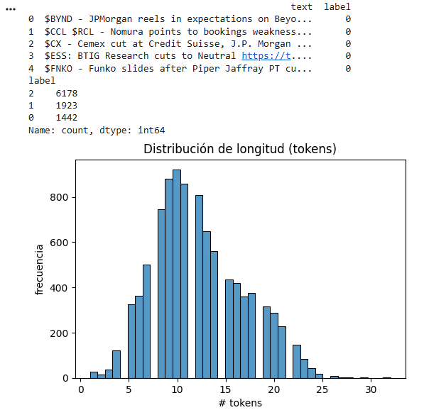
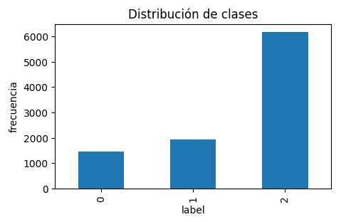
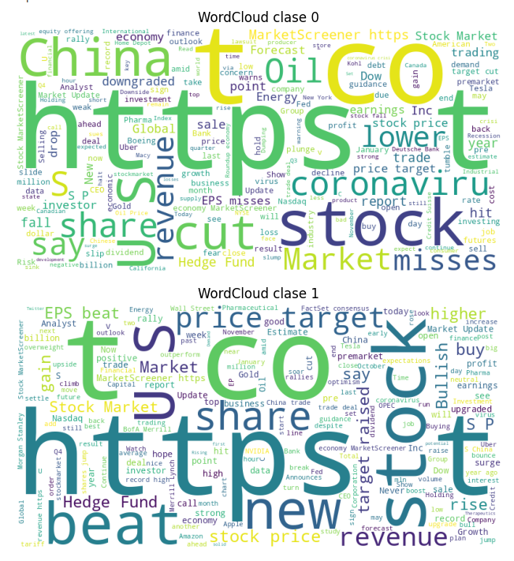
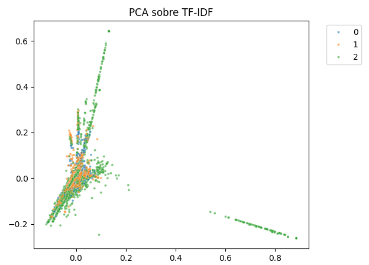
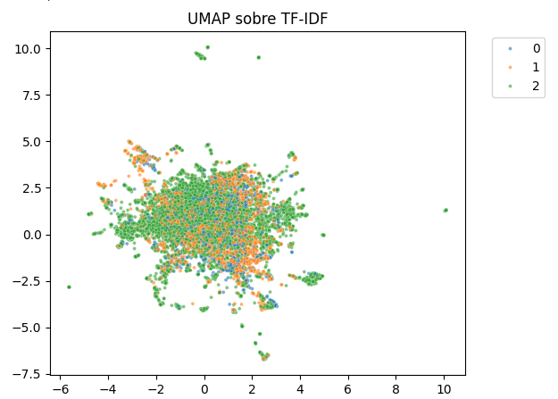
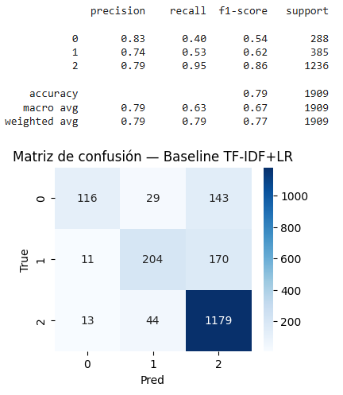
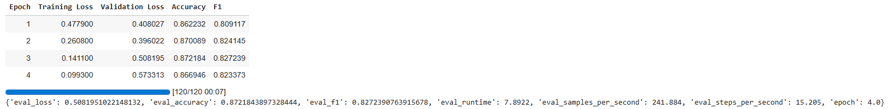
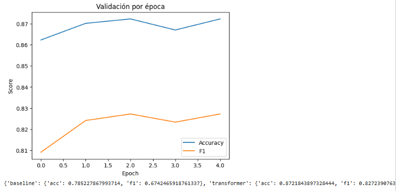

# Ajuste Fino de Transformadores para Clasificación Ofensiva

| Title | Date |
| --- | --- |
| Ajuste Fino de Transformadores para Clasificación Ofensiva | 29/11/25 |

# Ajuste Fino de Transformadores para Clasificación Ofensiva

## **Contexto**

En esta actividad vamos a crear, entrenar y ajustar modelos basados en Transformadores para realizar detección automática de lenguaje ofensivo. Usaremos técnicas modernas de Procesamiento de Lenguaje Natural (NLP). Tomaremos BERT como base pre-entrenada para realizar ajuste fino (Fine-Tuning). Esto nos permitirá capturar contexto, ambigüedad y variaciones del lenguaje, mejorando potencialmente la clasificación de ofensas o insultos.

## **Objetivo**

- Cargar y pre-procesar datasets de texto con datasets y tokenizers
- Aplicar fine-tuning de un modelo Transformer pre-entrenado (p. ej., BERT) para clasificación
- Evaluar y visualizar resultados con evaluate/scikit-learn/matplotlib
- Comparar enfoques: Bag of Words vs. Transformers

## **Actividades**

- **Parte 1: Setup y Exploración del Dataset**
- **Parte 2bis: EDA avanzada (TF‑IDF + proyección + Word2Vec)**
- **Parte 2: Baseline clásico (TF‑IDF + LogisticRegression)**
- **Parte 3: Fine-tuning con Hugging Face Transformers**
- **Parte 4: Visualizaciones y Comparación**

## **Desarrollo**

Comenzamos este práctico como todos los anteriores: preparando el entorno de trabajo, instalando las librerías necesarias para el trabajo que vamos a hacer y haciendo la carga inicial del dataset. El dataset que usaremos tiene noticias financieras provenientes de Twitter, disponible a través de Hugging Face Datasets. Estos breves textos tienen etiquetas según su sentimiento financiero (bearish o bajista [0], bullish o alcista [1], o neutral [2]), por esto tendremos 3 clases para describir el conjunto de datos. También podemos ver la distribución por cantidad de palabras en los textos. ([Evidencia 1](#evidencia-1)).

Utilizando WordCloud podemos generar un mapa visual donde tenemos las palabras de los textos pertenecientes a una clase, donde, mientras más grande la palabra, más aparece en los textos. ([Evidencia 2](#evidencia-2)). Podemos ver que en el caso de cuando se trata de un mercado bajista que aparecen seguido "cut", "misses", "China" y "Oil", entre otras. Mientras que cuando se trata de un mercado alcista aparecen más seguido "beat", "new", "revenue" y "stock". Esto tiene sentido, ya que son palabras que reflejan el estado o dirección del mercado. Por otro lado, vemos que cuando se trata de un mercado neutro, las palabras también lo son: "Stock", "business", "say", "CEO" y demás.

Podemos, además, observar visualmente la separabilidad de las clases en el espacio vectorial a partir del texto y las palabras que lo conforman. Para realizar esto usamos TF-IDF con un vocabulario de hasta 30.000 términos y n-gramas de 1 y 2 palabras, obteniendo una representación dispersa y de alta dimensión, que reducimos mediante PCA a 2 dimensiones. Con esta proyección podemos observar si existen patrones linealmente o agrupamientos simples basados únicamente en la frecuencia ponderada de términos lingüísticos. ([Evidencia 3](#evidencia-3)).

Luego usamos UMAP para convertir estos datos en una alternativa más expresiva para datos textuales, donde podemos ver de mejor forma los clústeres semánticos entre las clases. ([Evidencia 4](#evidencia-4)).

Con los datos explorados, podemos pasar al entrenamiento de nuestro modelo, el cual utilizará Regresión Logística (RL) para clasificar los textos en las 3 clases ya vistas. Volvemos a usar TF-IDF como vectorizador con vocabulario limitado a 10.000 características y n-gramas de 1 y 2 palabras una vez más, para capturar tanto términos individuales como combinaciones cortas relevantes para distinguir clases.  ([Evidencia 5](#evidencia-5)).

Esta manera de clasificar texto es una metodología sólida, pero podemos usar Transformadores para conseguir aún mejores resultados. Los Transformadores son un tipo de arquitectura de redes neuronales diseñadas específicamente para procesar secuencias (como texto) de manera más eficiente y precisa que modelos anteriores como hicimos con TF-IDF + RL. Intentaremos usar FinBERT, que es una variante del modelo BERT pre-entrenada específicamente en textos financieros; en el caso de que no esté disponible usaremos alternativas multilingües basadas en BERT también.

Usamos tokenización para convertir los textos en unidades más pequeñas (tokens), las cuales pueden ser palabras, subpalabras o caracteres. En estos casos estaremos usando tokenización basada en subpalabras (BPE), lo que nos permite manejar palabras desconocidas, variaciones de los morfemas y errores ortográficos, dividiéndolas en fragmentos significativos. Gracias a esto podemos transformar cada tweet a una secuencia numérica que el modelo puede procesar, manteniendo información sobre el significado y la estructura de la oración. Sin esta etapa el transformador no puede interpretar el texto ni aprender patrones para clasificar el sentimiento u ofensa presenta en los ejemplos.

Comparando ambas metodologías, podemos ver que el uso de Transformadores con ajuste fino supera el rendimiento de los modelos tradicionales. ([Evidencia 6](#evidencia-6)).

## **Evidencias**

### **Evidencia 1** {#evidencia-1}

### **Evidencia 2** {#evidencia-2}

### **Evidencia 3** {#evidencia-3}

### **Evidencia 4** {#evidencia-4}

### **Evidencia 5** {#evidencia-5}

### **Evidencia 6** {#evidencia-6}

## **Reflexión**

En esta actividad analizamos tweets relacionados con el ámbito financiero con el objetivo de identificar el sentimiento expresado y clasificarlo en tres categorías principales: bajista (bearish), alcista (bullish) o neutral, lo cual permite estimar el tono general del mercado. Para ello, comparamos dos enfoques: por un lado, un modelo tradicional basado en TF-IDF y Regresión Logística, y por otro, modelos modernos basados en Transformadores, entre ellos FinBERT, un modelo pre-entrenado específicamente en texto financiero. Los resultados mostraron que el enfoque tradicional funciona como una línea base razonable, pero los transformadores (especialmente FinBERT) lograron capturar mejor el contexto y las sutilezas del lenguaje financiero, obteniendo así un rendimiento superior. Esto evidencia la ventaja de utilizar modelos pre-entrenados especializados cuando se trabaja con dominios específicos como las finanzas.

## **Referencias**

*Assignment UT4-13: Fine-tuning de Transformers para Clasificación Ofensiva (ES) - Fundamentos del Aprendizaje Automático - Universidad Católica del Uruguay*. (n.d.). [https://juanfkurucz.com/ucu-ia/ut4/13-nlp-ofensivo-transformers-assignment/#parte-4-visualizaciones-y-comparacion](https://juanfkurucz.com/ucu-ia/ut4/13-nlp-ofensivo-transformers-assignment/#parte-4-visualizaciones-y-comparacion)

Stryker, C., & Bergmann, D. (2025, November 17). Transformer Model. *What is a transformer model?* [https://www.ibm.com/think/topics/transformer-model](https://www.ibm.com/think/topics/transformer-model)

*ProsusAI/finbert · Hugging Face*. (n.d.). [https://huggingface.co/ProsusAI/finbert](https://huggingface.co/ProsusAI/finbert)

*Google Colab*. (n.d.-k). [https://colab.research.google.com/drive/1TVM-hlU-M1bAUmr_pOGu2Oo56Ls-yA9A?usp=sharing](https://colab.research.google.com/drive/1TVM-hlU-M1bAUmr_pOGu2Oo56Ls-yA9A?usp=sharing)

