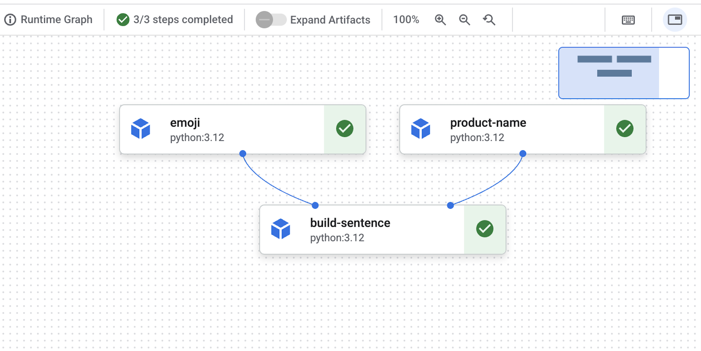

# Creacion de Pipelines con VertexAI en Google Cloud

| Title | Date |
| --- | --- |
| Creacion de Pipelines con VertexAI en Google Cloud | 01/12/25 |

# Creacion de Pipelines con VertexAI en Google Cloud

## **Contexto**

En esta actividad haremos el laboratorio de Google Skills sobre Vertex AI Pipelines. Aprenderemos a construir desde cero un flujo de trabajo reproducible que incluya carga de datos, entrenamiento, evaluacion y eventualmente despliegue de un modelo usando las herramientas integradas de Vertex AI.

## **Objetivo**

- Usar el SDK (Software Development Kit) de Kubeflow Pipelines para construir pipelines de ML (Machine Learning) escalables.
- Crear y ejecutar un pipeline introductorio de 3 pasos que recibe entrada de texto.
- Crear y ejecutar un pipeline que entrena, evalua y despliega un modelo de clasificacion AutoML.
- Usar componentes preconstruidos para interactuar con los servicios de Vertex AI, proporcionados a traves de la biblioteca google_cloud_pipeline_components.
- Programar un trabajo de pipeline con Cloud Scheduler.

## **Actividades**

- **Paso 0: Setup y Requerimientos**
- **Paso 1: Abrir el notebook en la Workbench de Vertex AI**
- **Paso 2: Armado de Pipelines de Vertex AI**
- **Paso 3: Crear la primera pipeline**
- **Paso 4: Crear una pipeline de ML de punta-a-punta**

## **Desarrollo**

En esta actividad seguiremos con los laboratorios de Google Skills, por lo cual, si el lector es estudiante de alguna organizacion puede registrarse con ese correo y recibira creditos gratuitos que puede usar para probar el practico por su cuenta.

Como hablamos en la actividad pasada, el area de Machine Learning es mucho mas que la creacion, entrenamiento y prueba de los modelos. Para poder llevar un modelo de ML al mundo real se requiere mucha consideracion y analisis previo del entorno en el cual estara el modelo. Gracias a los servicios de Google Cloud podemos acceder a esto de manera mas sencilla.

Un concepto utilizado en la rama de computacion DevOps es el CI/CD (Continuous Integration/Continuous Development, o Integracion Continua/Desarrollo Continuo), que tambien aplica al area de MLOps. 

La herramienta predilecta hoy en dia para lograr que un sistema tenga CI/CD es el uso de Pipelines. Estas nos permiten automatizar, estandarizar y encadenar todas las etapas del ciclo de vida de una aplicacion o modelo, desde la integracion y pruebas hasta el despliegue y monitoreo. Al definir procesos reproducibles y ejecutables de forma consistente, perdemos la necesidad de tener que hacer estos procesos a mano, donde el programador puede cometer errores, lo que en el mundo real significa costos monetarios. Estas pipelines aceleran la entrega del producto y garantizan que cada paso sea validado de manera controlada antes de llegar a produccion.

Vertex AI ofrece un entorno unificado y totalmente gestionado para construir pipelines de Machine Learning que sean reproducibles, escalables y faciles de mantener. Con Vertex AI Pipelines podemos coordinar todas las etapas del ciclo de vida de un modelo (consumo y preparacion de datos, entrenamiento, evaluacion, tuning, validacion y despliegue) utilizando componentes declarativos y ejecutandolos sobre infraestructura administrada por Google Cloud. 

Esto nos deja automatizar flujos complejos, reutilizar pasos entre experimentos y garantizar consistencia entre entornos, todo sin tener que gestionar servidores ni infraestructura subyacente. Es por esto que Vertex AI es una herramienta sumamente potente para implementar practicas de MLOps modernas y robustas.

El practico nos guia de como armar nuestro ambiente de desarrollo, completamente montado en la nube y automatizado. Una vez tenemos el ambiente armado podemos empezar a armar nuestra pipeline. Lo que nos propone este practico es armar una simple pipeline ilustrativa que tiene varios componentes, que nos deje concatenar un texto con la interpretacion de un emoji.

Nos dan los codigos prontos para ser corridos en la mesa de trabajo de VertexAI, donde armamos componentes que tienen entradas y devuelven salidas. 

El primer componente simplemente nos devuelve el texto ingresado, el segundo toma un texto y devuelve el equivalente emoji que representa y el texto que describe al emoji; y el tercer y ultimo nos concatena la salida del primero con la salida del segundo. De esta manera tenemos un pipeline de VertexAI sencillo que funciona exitosamente. ([Evidencia 1](#evidencia-1)).

Luego la actividad nos lleva a hacer un "End-To-End" pipeline, o pipeline de Punta-A-Punta. Esto significa que integramos en un mismo flujo automatizado todas las fases necesarias para entrenar, evaluar y decidir el despliegue de un modelo, asegurando asi un proceso reproducible y completamente orquestado.

Empezamos por crear un componente que encapsula la etapa de evaluacion de un modelo de clasificacion, entrenado con AutoML Tabular, que es el encargado de centralizar toda la logica necesaria para interpretar los resultados del entrenamiento. Su funcion es recuperar las metricas generadas durante el entrenamiento, procesarlas y registrarlas para que el pipeline pueda analizarlas.

Despues empezamos a definir los pasos principales del pipeline, donde primero creamos un dataset, luego entrenamos un modelo de clasificacion, volviendo a usar AutoML Tabular y luego incorporamos el componente de evaluacion para analizar la calidad del modelo entrenado. 

Finalmente, el pipeline utiliza el resultado de esa evaluacion para decidir automaticamente si el modelo debe ser desplegado o no. ([Evidencia 2](#evidencia-2)).

## **Evidencias**

### **Evidencia 1** {#evidencia-1}

.png)

### **Evidencia 2** {#evidencia-2}

## **Reflexion**

En esta actividad pudimos usar VertexAI, a traves de Google Cloud, para crear pipelines que automatizan el CI/CD de soluciones de Machine Learning. Creamos componentes con proposito desde cero y los conectamos con otros, permitiendonos tener una manera estandarizada y automatica, desde la integracion y entrenamiento hasta el testeo y validacion del modelo.

## **Referencias**

Skills, G. (n.d.). *Vertex AI Pipelines: QWIK Start | Google Skills*. Google Skills. [https://www.skills.google/focuses/21234?catalog_rank=%7B%22rank%22%3A1%2C%22num_filters%22%3A1%2C%22has_search%22%3Atrue%7D&parent=catalog&search_id=60909255](https://www.skills.google/focuses/21234?catalog_rank=%7B%22rank%22%3A1%2C%22num_filters%22%3A1%2C%22has_search%22%3Atrue%7D&parent=catalog&search_id=60909255)

