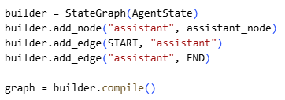
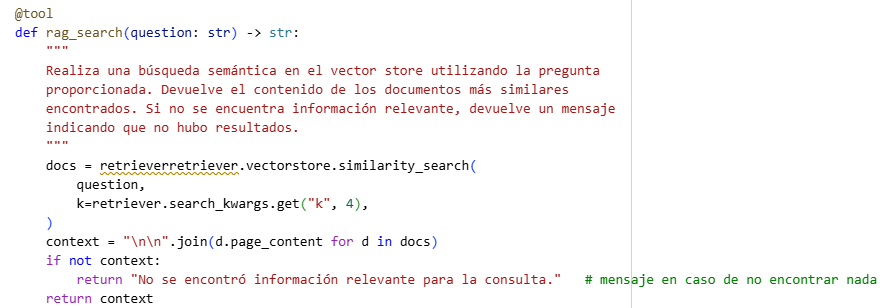
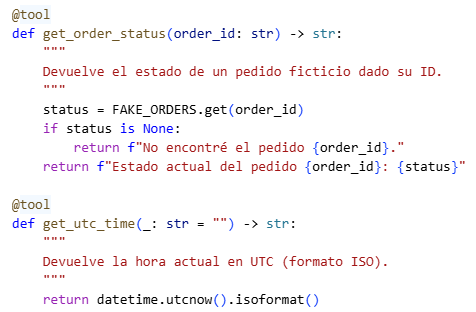
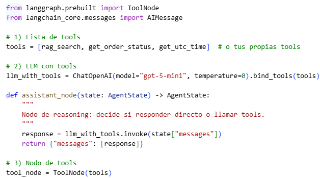
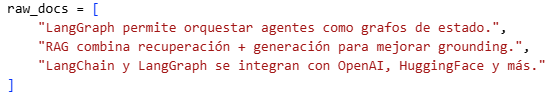
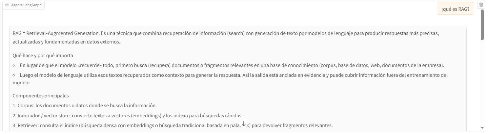
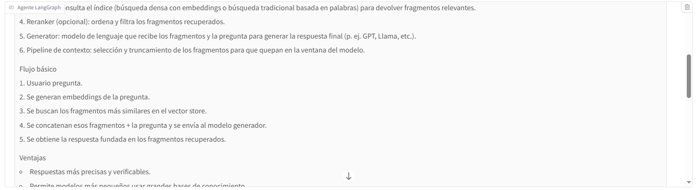
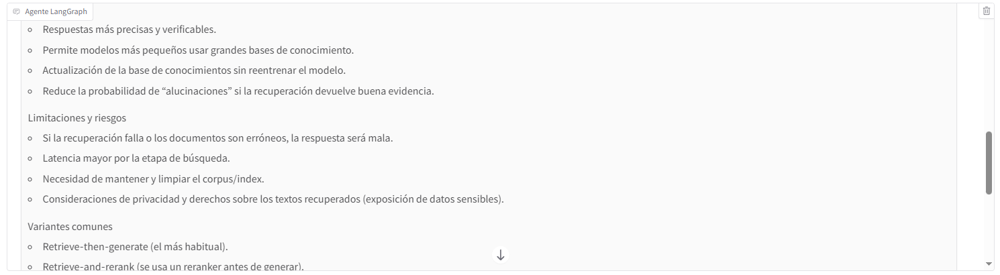
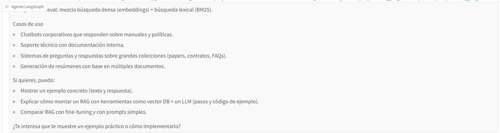

# Creación de un Agente de Inteligencia Artificial con LangGraph y OpenAI

| Title | Date |
| --- | --- |
| Creación de un Agente de Inteligencia Artificial con LangGraph y OpenAI | 30/11/25 |

# Creación de un Agente de Inteligencia Artificial con LangGraph y OpenAI

## **Contexto**

En esta actividad exploramos cómo construir un agente básico utilizando LangGraph, una herramienta diseñada para crear flujos conversacionales estructurados y controlados. A partir de un estado que mantiene el historial de mensajes, definimos nodos que representan comportamientos del agente y conectamos estos nodos mediante un grafo que determina el flujo de la conversación. El objetivo es comprender cómo LangGraph permite orquestar interacciones conversacionales de forma modular, transparente y extensible, sentando las bases para agentes más avanzados con memoria, herramientas y lógica personalizada.

## **Objetivo**

- Diseñar un estado de agente (AgentState) para conversaciones multi-turn.
- Construir un agente con LangGraph que:
    - use un modelo de chat (OpenAI) como reasoner,
    - llame tools externas (RAG + otra tool),
    - y mantenga el historial de conversación.
- Integrar RAG como tool reutilizable (retriever + LLM).
- Agregar tools adicionales (p.ej. utilidades, "servicios" dummy).
- Orquestar LLM + tools en un grafo: assistant ↔ tools con bucles.
- Ejecutar conversaciones multi-turn y observar cómo evoluciona el estado.

## **Actividades**

- **Parte 0: Setup y *Hello Agent* (LangGraph mínimo)**
- **Parte 1: Estado del agente con memoria "ligera"**
- **Parte 2: Construir un RAG "mini" para usarlo como tool**
- **Parte 3: Otra tool adicional (no RAG)**
- **Parte 4: LLM con tool calling + ToolNode en LangGraph**
- **Parte 5: Conversación multi-turn con el agente**
- **Parte 6: Interfaz Gradio para probar el agente**

## **Desarrollo**

Como en la actividad previa, antes de empezar, si el lector quiere, puede utilizar el archivo de Google Colab de las referencias para probar los modelos en su propia máquina. Para hacer esto deberá tener su llave API de [LangSmith](https://smith.langchain.com/) y [OpenAI](https://platform.openai.com/api-keys). De igual manera, podrá explorar este informe y ver los resultados obtenidos.

Para comenzar definimos la estructura fundamental sobre la que operará nuestro agente dentro de LangGraph: AgentState (estado del agente). Este será representado mediante un TypedDict (o diccionario tipado). Este estado contiene una lista de mensajes que funciona como historial conversacional del agente, donde, cada vez que se generen nuevos mensajes estos serán guardados en el estado acumulado. Esto permite mantener un seguimiento completo de la interacción, lo que le permite al modelo tener toda la información previa a la hora de recibir un mensaje nuevo, simulando como funciona una conversación natural entre dos personas.

A continuación definimos el primer nodo del grafo: assistant_node. Un nodo en LangGraph representa un paso de procesamiento dentro del flujo del agente, y en este caso su responsabilidad es simple pero central: llamar al modelo de lenguaje pasando el historial completo del estado. El nodo devuelve un diccionario con los nuevos mensajes, que serán agregados al estado siguiendo la regla de combinación definida anteriormente. Así el agente produce una respuesta con sentido, basándose en todo lo que se ha dicho previamente.

Con esto podemos construir el grafo de estados utilizando StateGraph, agregándo el nodo asistente y definimos un flujo mínimo: desde START hacia el nodo asistente y luego hacia el END. Este grafo lineal va a ejecutar el nodo una única vez, pero ya es suficiente para capturar la esencia del modelo mental de LangGraph, que es de representar agentes como transiciones explícitas entre nodos que manipulan estados. ([Evidencia 1](#evidencia-1)).

Luego introducimos un nuevo concepto, el del estado compartido dentro de un agente. En lugar de procesar cada interacción de forma aislada, el agente mantiene ciertos elementos persistentes (como los mensajes intercambiados y un posible resumen) que le permiten comprender de mejor manera el contexto y evolución o progreso de la conversación. Este enfoque nos sirve para que el agente tenga una conducta más coherente, sin olvidarse de qué viene hablando el usuario y qué contestó él mismo, pudiendo condensarlo cuando sea necesario.

Además, podemos hacer uso de un corpus mínimo y transformarlo en piezas manejables (chunks) para que luego el agente las use cuando las necesite. Haciendo esto tenemos un agente que combina memoria, contexto y acceso a información externa, lo que nos da un asistente más inteligente, no solo capaz de responder, sino también de recordar, resumir y apoyarse en información adicional cuando lo requiera.

Podemos hacer uso de herramientas para que el agente pueda realizar tareas de mejor manera, como puede ser la busca de información relevante dentro de un conjunto de elementos. La idea es que el agente no dependa solo de su modelo de lenguaje, sino que tenga acceso a un mecanismo externo que recupera datos reales desde un índice de vectores. El agente recibe un prompt y si ve que tiene que usar esta herramienta, la instancia y le pasa la pregunta, realizando una búsqueda semántica y devolviendo los fragmentos de texto más cercanos al contenido consultado. ([Evidencia 2](#evidencia-2)). Podemos hacer esto con cualquier herramienta que nos sea útil para mejorar el rendimiento y capacidad del agente. ([Evidencia 3](#evidencia-3)).

Con las herramientas disponibles, ahora el agente puede tomar la decisión por sí mismo de si responde directo o si llamar a las herramientas dará un mejor resultado (mejor calidad, menor tiempo o menor costo). ([Evidencia 4](#evidencia-4)).

A continuación podemos ver algunas preguntas y respuestas a nuestro nuevo agente, armado con las herramientas vistas. ([Evidencia 5](#evidencia-5)). Podemos ver como el agente da una respuesta coherente según el contexto que le dimos, siguiendo el sentido del primer texto. También podemos explicitarle al agente cómo nos debe contestar. ([Evidencia 6](#evidencia-6)). A su vez podemos revisar cómo son almacenados los mensajes para darle contexto al agente. ([Evidencia 7](#evidencia-7)).

Finalmente podemos levantar una interfaz para conversar con el agente, teniendo un producto funcional más similar a lo que estamos acostumbrados hoy en día con ChatGPT o Gemini en la web. ([Evidencia 8](#evidencia-8)).

## **Evidencias**

### **Evidencia 1** {#evidencia-1}



```
Prompt:
	"Probando mi primer agente LangGraph :)"
Respuesta:
	¡Genial — felicidades por el primer agente! 🙂 ¿Qué te gustaría probar ahora o en qué necesitas ayuda?

Puedo ayudarte con varias cosas, por ejemplo:
- Ejecutar una conversación de prueba / simular interacciones.
- Generar prompts de prueba o ejemplos de intents/respuestas.
- Revisar la configuración del agente (acciones, conectores, credenciales).
- Depurar errores (logs, permisos, respuestas inesperadas).
- Proporcionar un snippet de código para llamar al agente desde tu app.

Dime qué prefieres: ¿quieres que simule una conversación ahora, que revise alguna configuración concreta, o que te dé un ejemplo de integración?
```

### **Evidencia 2** {#evidencia-2}



### **Evidencia 3** {#evidencia-3}



### **Evidencia 4** {#evidencia-4}



### **Evidencia 5** {#evidencia-5}



```
Prompt:
	Hola, ¿qué es LangGraph en pocas palabras?
Respuesta:
	LangGraph es una herramienta/plataforma para diseñar, ejecutar y depurar aplicaciones basadas en modelos de lenguaje usando diagramas de flujo (grafos). En pocas palabras: te permite conectar nodos (modelos, prompts, herramientas, pasos de lógica) visualmente, probar y monitorear las ejecuciones, y luego exportar o ejecutar ese flujo como código/servicio. Su objetivo es acelerar el desarrollo, facilitar la colaboración y mejorar la trazabilidad y depuración de pipelines LLM.  

	¿Quieres que te muestre un ejemplo rápido o sus principales características?
```

### **Evidencia 6** {#evidencia-6}

```
Prompt:
	"Usá tu base de conocimiento y decime qué es RAG."
Respuesta:
	RAG = Retrieval‑Augmented Generation. En pocas palabras: es una técnica que combina recuperación de información (search) con generación de texto por un modelo de lenguaje para producir respuestas más precisas y con respaldo documental.
	
	Resumen práctico
	- Qué hace: antes de generar, el sistema recupera documentos relevantes de una base de conocimientos; luego el LLM usa esos documentos como contexto para generar la respuesta.
	- Objetivo: reducir alucinaciones y permitir respuestas actuales/específicas sin necesidad de fine‑tuning completo del modelo.
	
	Componentes principales
	1. Retriever (recuperador): busca documentos relevantes en una colección. Puede ser:
	 - Denso (embeddings + búsqueda vectorial).
	 - Disperso (BM25, búsqueda por palabras).
	2. Document store / Vector store: donde están los textos indexados (chunking, metadatos, embeddings).
	3. Reranker (opcional): reordena o filtra los candidatos recuperados.
	4. Generator (LLM): toma la consulta + los documentos recuperados como contexto y genera la respuesta.
	5. Pipeline de mezcla: cómo se incorpora la evidencia al prompt (concatenación simple, prompting con few‑shot, métodos RAG‑Sequence/RAG‑Token).
	
	Variantes técnicas relevantes
	- RAG‑Sequence: el modelo genera usando los documentos ya seleccionados como contexto fijo.
	- RAG‑Token: el modelo puede considerar diferentes documentos en cada paso de generación (más complejo).
	- Retrieve‑then‑read vs retrieve‑and‑generate: distintos flujos de cómo se combinan recuperación y generación.
	
	Ventajas
	- Respuestas más concretas y verificables.
	- Actualización de conocimiento sin reentrenar el LLM (solo actualizar la base de datos/embeddings).
	- Posibilidad de citar fuentes y mostrar evidencia.
	
	Limitaciones y riesgos
	- Si los documentos recuperados son irrelevantes o erróneos, la salida puede seguir siendo incorrecta.
	- Dependencia de la calidad del chunking y del motor de búsqueda.
	- Coste adicional por consultas y por tokens de contexto (si el contexto es grande).
	- Gestión de fuentes y confidencialidad si se usan datos sensibles.
	
	Buenas prácticas
	- Indexar textos en fragmentos (chunking) con cuidado del tamaño.
	- Usar re‑ranking y filtrado para mejorar precisión de los top‑k recuperados.
	- Incluir metadatos y citas en la respuesta para trazabilidad.
	- Limitar y controlar la longitud del contexto para no saturar la ventana del LLM.
	- Evaluar con métricas de relevancia y factualidad (Precision@k, exactitud en respuestas, tasa de citación correcta).
	
	Casos de uso típicos
	- Asistentes que responden con documentación interna (FAQ, manuales, políticas).
	- Búsqueda conversacional y sistemas de soporte al cliente.
	- Generación de resúmenes de documentos largos usando pasajes relevantes.
	- Sistemas que necesitan conocimientos actualizados (noticias, bases legales).
	
	¿Quieres un ejemplo concreto (arquitectura, pseudocódigo o un mini‑pipeline con OpenAI/embeddings + vector store)?
```

### **Evidencia 7** {#evidencia-7}

```
Último mensaje: human → Usá tu base de conocimiento y decime qué es RAG.
Último mensaje: ai → RAG = Retrieval-Augmented Generation. En pocas palabras: es una técnica que combina búsqueda (recuperación) sobre una base de conocimiento con generación por un modelo de lenguaje para producir respuestas más informadas y con acceso a datos que el LLM no memoriza.

Concepto y cómo funciona (resumen):
- Paso 1 — Recuperación: se toma la pregunta/consulta del usuario y se busca documentación relevante en una base de datos (texto plano, documentos, embeddings en un vector DB, etc.).  
- Paso 2 — Enriquecimiento: los fragmentos recuperados se pasan como contexto (o "evidence") al modelo de lenguaje.  
- Paso 3 — Generación: el LLM genera la respuesta condicionada en la consulta y en los fragmentos recuperados.

Componentes comunes:
- Indexador: divide y indexa documentos (chunking, embeddings).  
- Retriever: vector search / BM25 / re-ranker que trae los pasajes más relevantes.  
- LLM (generador): produce la respuesta usando los pasajes como contexto.  
- Mecanismos de fusión/re-rank: a veces se reordena o se combina evidencia antes de generar.

Variantes técnicas:
- RAG-Sequence / RAG-Token (métodos originales de Facebook) y enfoques como Fusion-in-Decoder (FiD): difieren en cómo se pasan y combinan los pasajes al decoder del modelo.
- Recuperación explícita + prompting (p. ej. "give answer and cite sources") es una práctica habitual.

Ventajas:
- Respuestas más actualizadas y específicas (no dependen solo del conocimiento interno del LLM).  
- Menor tamaño del modelo necesario para acceder a gran volumen de información.  
- Mejora la factualidad cuando la recuperación es buena.

Limitaciones y riesgos:
- Si el retriever trae pasajes irrelevantes o erróneos, el LLM puede mezclarlos y "alucinar" hechos.  
- Latencia mayor (consulta al índice + generación).  
- Necesidad de mantener el índice actualizado y de tener buena calidad de embeddings/re-ranker.  
- Gestión de contexto: hay límites de tokens y hay que seleccionar/recortar pasajes.

Buenas prácticas:
- Buena segmentación y embeddings de los documentos.  
- Re-rankeos y filtros (por fecha, fuente, metadata).  
- Prompting que indique al LLM citar fuentes o decir "no sé" si no hay evidencia.  
- Evaluar la precisión factual y medir el rendimiento con ejemplos reales.

Casos de uso típicos:
- Asistentes empresariales con acceso a documentación interna.  
- Soporte al cliente con base de conocimientos.  
- Sistemas de búsqueda conversacional y generación de resúmenes sobre documentos.

Si querés, te muestro un diagrama simple del flujo o un ejemplo concreto de prompt + formato de pasajes recuperados. ¿Querés eso?
```

### **Evidencia 8** {#evidencia-8}










## **Reflexión**

En esta actividad pudimos armar un ambiente donde fuimos armando un agente de Inteligencia Artificial, haciendo uso de LangGraph, basándonos en el modelo del GPT-5-mini de OpenAI. Vimos qué es el contexto y las herramientas para un agente, cómo las usa y cómo almacena dicho contexto. Pudimos explorar con el armado de un corpus mínimo para que el modelo pueda generar mejores respuestas sobre ciertos temas específicos. Finalmente pudimos levantar una interfaz donde podemos intercambiar mensajes con el agente, preguntándole cosas y explicitando la manera en la que queremos que razone.

## **Referencias**

*Assignment UT4-14: Agentes con LangGraph — RAG, Tools y Memoria Conversacional - Fundamentos del Aprendizaje Automático - Universidad Católica del Uruguay*. (n.d.). [https://juanfkurucz.com/ucu-ia/ut4/15-agents/#parte-6-memoria-ligera-summary-como-nodo-extra-opcional](https://juanfkurucz.com/ucu-ia/ut4/15-agents/#parte-6-memoria-ligera-summary-como-nodo-extra-opcional)

*LangGraph*. (n.d.). [https://www.langchain.com/langgraph](https://www.langchain.com/langgraph)

*gpt-5-mini-2025-08-07*. (n.d.). [https://platform.openai.com/docs/models/gpt-5-mini](https://platform.openai.com/docs/models/gpt-5-mini)

*Google Colab*. (n.d.-m). [https://colab.research.google.com/drive/1oACxW94vEqx5KhUXWnwqAlQICWzM7pek?usp=sharing](https://colab.research.google.com/drive/1oACxW94vEqx5KhUXWnwqAlQICWzM7pek?usp=sharing)

