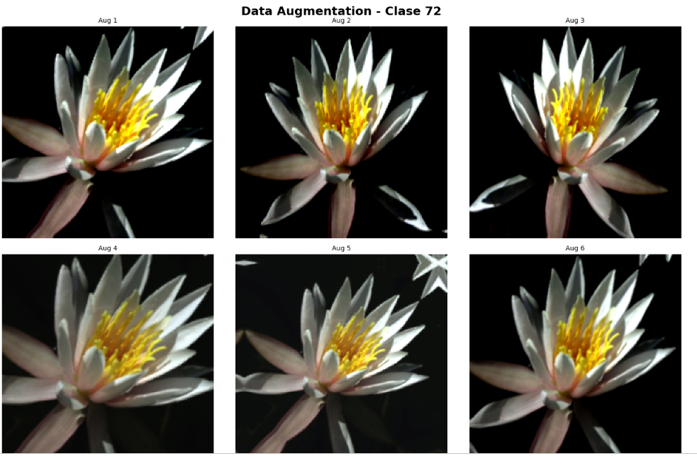
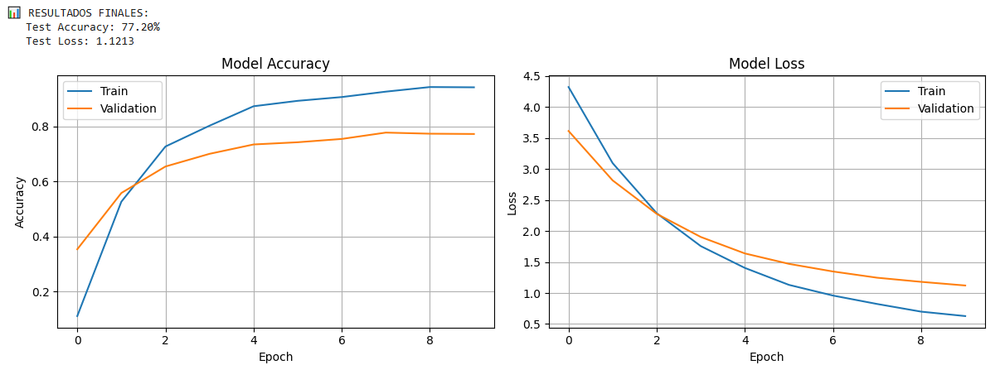
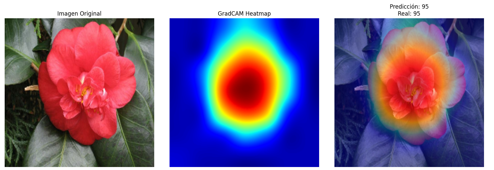
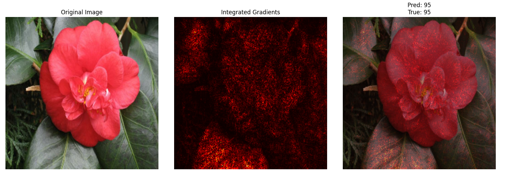

# Data Augmentation y Clasificación de Flores

| Title | Date |
| --- | --- |
| Data Augmentation y Clasificación de Flores | 08/11/25 |

# Data Augmentation y Clasificación de Flores

## **Contexto**

En esta actividad utilizaremos el conjunto de datos Oxford Flowers102 para el reconocimiento de flores mediante técnicas de Data Augmentation. Este dataset incluye imágenes de múltiples especies de flores, lo que nos permitirá entrenar un modelo de clasificación de imágenes. Además, aplicaremos técnicas de Data Augmentation para incrementar la variabilidad de las muestras y mejorar la generalización del modelo, junto con GradCAM para visualizar y explicar las zonas de la imagen que el modelo considera relevantes en su proceso de decisión. Finalmente, entrenaremos una red neuronal convolucional utilizando estas herramientas para analizar tanto su rendimiento como su capacidad de explicación.

## **Objetivos**

- Entrenar un modelo robusto que:
    - Clasifique correctamente
    - Sea robusto ante variaciones
    - Provea explicaciones visuales de sus predicciones

## **Actividades**

- **Parte 1: Setup y carga de datos**
- **Parte 2: Pipeline de Data Augmentation**
- **Parte 3: Cutup y Mixup**
- **Parte 4: Entrenamiento**
- **Parte 5: Explicabilidad con GradCAM**
- **Parte 6: Integrated Gradients**

## **Desarrollo**

Las Redes Neuronales Convolucionales (CNNs) son una herramienta sumamente poderosa para la clasificación de imágenes. En la actividad anterior exploramos su funcionamiento, tanto mediante la construcción de modelos desde cero como a través del uso de Transfer Learning. En esta ocasión, aplicaremos CNNs para clasificar imágenes de flores según su tipo, aprovechando su capacidad para identificar patrones visuales complejos.

Para optimizar el proceso de entrenamiento, es fundamental contar con una tarjeta gráfica (GPU), ya que permite realizar cálculos de manera mucho más eficiente que una CPU. En caso de no disponer de una GPU local, se recomienda utilizar Google Colab, que ofrece acceso gratuito a recursos de cómputo acelerado.

Con nuestro ambiente ya armado, procedemos a armar el pipeline base (Baseline) encargado de preparar los datos antes del entrenamiento del modelo. Este pipeline organiza las imágenes en lotes (batches), mezcla aleatoriamente los ejemplos en el conjunto de entrenamiento y aplica la normalización correspondiente al preprocesamiento de EfficientNet, garantizando que las imágenes estén en el formato y rango adecuados para el modelo.

Además, se optimiza el rendimiento del flujo de datos mediante la técnica de prefetching, que permite cargar nuevos lotes mientras el modelo entrena, reduciendo tiempos de espera. Con esto se generan los dataloaders de entrenamiento y prueba que servirán como base para los experimentos posteriores, sobre los cuales luego se incorporarán técnicas más avanzadas como Data Augmentation.

Para aplicar Data Augmentation se utiliza la clase Sequential de Keras, que permite definir una secuencia de transformaciones aplicadas directamente sobre las imágenes de entrenamiento. En este caso, se combinan transformaciones geométricas, como inversión horizontal, rotación y zoom, junto con transformaciones fotométricas, como ajustes de brillo y contraste. Estas operaciones generan versiones modificadas de las imágenes originales, aumentando la diversidad del conjunto de datos sin necesidad de recolectar más muestras ([Evidencia 1](#evidencia-1)).

Luego, se construye un pipeline de datos con aumento avanzado, donde las imágenes son procesadas en lotes y se aplican las transformaciones de augmentation antes de la normalización requerida por EfficientNet. Este enfoque permite que el modelo se entrene con ejemplos visualmente variados, mejorando su capacidad de generalización y reduciendo el sobreajuste. Finalmente, se optimiza el flujo con prefetching para mantener un entrenamiento eficiente.

cutmix y mixup

Podemos aplicar técnicas avanzadas de data augmentation llamadas MixUp y CutMix, utilizadas para mejorar la capacidad de generalización de los modelos de visión por computadora. Ambas estrategias combinan imágenes y etiquetas de forma sintética, creando ejemplos intermedios que enriquecen el conjunto de entrenamiento y ayudan al modelo a aprender relaciones más suaves entre las clases, reduciendo el sobreajuste (overfitting).

MixUp mezcla dos imágenes y sus etiquetas mediante una combinación lineal controlada por un coeficiente aleatorio, generado a partir de una distribución Beta. Así, el modelo ve imágenes híbridas (por ejemplo, mitad “gato”, mitad “perro”) con etiquetas proporcionales a esa mezcla, lo que promueve una transición más continua entre clases.

Por su parte, CutMix sustituye una región rectangular de una imagen por el fragmento correspondiente de otra, ajustando las etiquetas en proporción al área reemplazada. De esta forma, el modelo aprende a identificar objetos incluso cuando están parcialmente visibles o mezclados en distintos contextos. En el código, se definen ambas funciones (mixup y cutmix) y se integran en un pipeline, permitiendo que estas transformaciones se apliquen dinámicamente durante el entrenamiento. Esto genera lotes de imágenes enriquecidas con variaciones sintéticas, mejorando la robustez y precisión final de la red neuronal. Con esto hecho, podemos pasar al entrenamiento del modelo.

A su vez, podemos usar GradCAM para visualizar dónde está mirando nuestro modelo a la hora de hacer una predicción. Esto es útil para saber si realmente está funcionando como debería, haciendo predicciones de manera lógica y asimilada a como lo hace una persona, y no simplemente memorizando una imagen. En nuestro caso, si el modelo está funcionando de manera correcta, hará predicciones del tipo de flor mirando a la flor en sí, y no tanto a las hojas o el fondo de la imagen.

Por último podemos usar Integrated Gradients, la cual es una técnica de interpretabilidad que permite entender qué partes de una imagen influyen más en la predicción del modelo. Calcula la contribución de cada píxel y lo compara con una imagen negra (imagen base), intercalando entre la imagen original y la imagen negra, midiendo en cada uno los gradientes de la predicción respecto a los píxeles. Luego, promediando estos gradientes y multiplicando por la diferencia entre imágenes obtenemos un “mapa” que nos muestra las zonas determinantes para la predicción.

## **Evidencias**

### **Evidencia 1** {#evidencia-1}

### **Evidencia 2** {#evidencia-2}

### **Evidencia 3** {#evidencia-3}

### **Evidencia 4** {#evidencia-4}

## **Reflexión**

En esta actividad pudimos crear una Red Convolucional Neuronal que logre identificar exitosamente flores del dataset de imagenes Flowers102 de Oxford. Usamos distintas técnicas de Data Augmentation para hacer que el modelo sea más robusto y soporte mayores variaciones en las imágenes y pudimos usar GradCAM e Integrated Gradients para poder tener mayor explicabilidad de qué “mira” nuestra red a la hora de hacer las predicciones.

## **Referencias**

*Assignment UT3-10: Data Augmentation Avanzado & Explicabilidad - Fundamentos del Aprendizaje Automático - Universidad Católica del Uruguay*. (n.d.). [https://juanfkurucz.com/ucu-ia/ut3/10-data-augmentation-xai-assignment/](https://juanfkurucz.com/ucu-ia/ut3/10-data-augmentation-xai-assignment/)

*Visual Geometry Group - University of Oxford*. (n.d.). [https://www.robots.ox.ac.uk/~vgg/data/flowers/102/](https://www.robots.ox.ac.uk/~vgg/data/flowers/102/)

Selvaraju, R. R., Cogswell, M., Das, A., Vedantam, R., Parikh, D., Batra, D., Selvaraju, R. R., Cogswell, M., Das, A., Vedantam, R., Parikh, D., & Batra, D. (2019). Grad-CAM: Visual Explanations from Deep Networks via Gradient-Based Localization. *International Journal of Computer Vision*, *128*(2), 336–359. [https://doi.org/10.1007/s11263-019-01228-7](https://doi.org/10.1007/s11263-019-01228-7)

Sundararajan, M., Taly, A., & Yan, Q. (2017, March 4). *Axiomatic attribution for deep networks*. arXiv.org. [https://arxiv.org/abs/1703.01365](https://arxiv.org/abs/1703.01365)

*Google Colab*. (n.d.-i). [https://colab.research.google.com/drive/1WYDeVdUBVPc11swFmnaoy3kutiYXgrBV?usp=sharing](https://colab.research.google.com/drive/1WYDeVdUBVPc11swFmnaoy3kutiYXgrBV?usp=sharing)