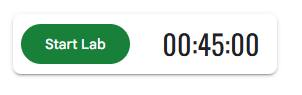
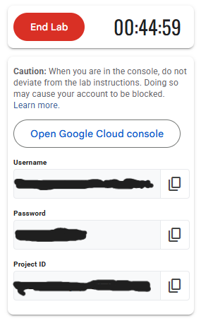

# Introduccion a Google Cloud para Machine Learning

| Title | Date |
| --- | --- |
| Introduccion a Google Cloud para Machine Learning | 01/12/25 |

# Introduccion a Google Cloud para Machine Learning

## **Contexto**

En esta actividad empezamos con la unidad de Machine Learning Operations (MLOps) y estaremos haciendo uso de un curso introductorio de Google Skills, haciendo un tour de Google Cloud con Hands-On Labs. Exploraremos la plataforma y veremos las distintas herramientas que ofrece la plataforma.

## **Objetivo**

- Acceder a la consola de Cloud para explorar la plataforma del laboratorio.
- Identificar las caracteristicas clave de un entorno de laboratorio.
- Ver proyectos de Google Cloud e identificar conceptos erroneos.
- Usar la consola de navegacion de Google Cloud para identificar los tipos de servicios ofrecidos.
- Administrar roles basicos y usar el servicio de Cloud IAM para inspeccionar permisos de usuarios.
- Explorar la libreria de APIs.

## **Actividades**

- **Parte 1: Acceder a la consola de Cloud**
- **Parte 2: Ver proyectos en la consola de Cloud**
- **Parte 3: Revisar y modificar roles y permisos**
- **Parte 4: Habilitar APIs y servicios**
- **Parte 5: Terminar el laboratorio**

## **Desarrollo**

En el mundo de la Inteligencia Artificial, y particularmente en la rama de Machine Learning, hay muchas preconcepciones erroneas. La mayor de todas es que lo mas importante de un modelo de Machine Learning es que el codigo del mismo es el componente mas grande y mas importante de la solucion. Este no es el caso.

Si bien el codigo, los algoritmos y estructuras utilizadas para el armado y diseno de un modelo de Machine Learning son sumamente importantes, no terminan siendo mas del 5% de la solucion entera. El modelo en si, se lo puede ver como el motor de un vehiculo: es el corazon del mismo, le da potencia y sentido de ser, pero no es la unica pieza que compone al mismo. Un vehiculo tiene carroceria, transmision, sistema de frenado, sistemas electronicos y demas. Lo mismo pasa con una solucion de Machine Learning.

Es por esto que surge el campo de MLOps, haciendo honor a la rama de DevOps, el cual busca unificar el desarrollo y mantenimiento de las soluciones de Machine Learning. En esta rama se trata con todo lo referente al armado del ecosistema donde va a correr la solucion de Machine Learning, desde el testing y debugging, la configuracion del sistema, el analisis del modelo, la coleccion de datos; hasta el monitoreo del sistema, manejo de recursos y automatizacion, entre otros elementos.

Con esto en mente, es claro que MLOps no es una rama sencilla de aprender, pero gracias a Google Skills, tenemos cursos de capacitacion, aprendizaje y guiado de la plataforma Google Cloud. Esta plataforma es un conjunto de servicios en la nube alojados en la infraestructura de Google, con una gran variedad de servicios y APIs que podemos integrar en cualquier aplicacion o proyecto de computacion en la nube, tanto a nivel personal como empresarial.

En este curso introductorio empezamos familiarizandonos con Qwiklabs, una plataforma tecnologica que usa Google para albergar laboratorios y cursos. El uso de esta plataforma nos da una experiencia "Hands-on", dandonos un aprendizaje practico. Para empezar este curso tendremos que presionar el boton "Start Lab", que nos levanta una instancia de laboratorio donde podremos contestar preguntas, mientras nos mantienen un control de las respuestas que vamos dando. ([Evidencia 1](#evidencia-1)). En este laboratorio tenemos 45 minutos, de los cuales una vez terminados (o al presionar el boton de "End Lab"), se cerrara nuestra instancia de laboratorio, borrando todos los datos que teniamos. Es por esto que es importante estar atentos al tiempo y tratar de hacer todo lo antes posible. Los laboratorios suelen costar creditos (este no tiene costo, debido a que es introductorio). Si el lector es estudiante de alguna organizacion puede registrarse con ese correo y recibira creditos gratuitos.

El laboratorio nos guia de manera clara como utilizar ambas plataformas. Vale la pena aclarar que los laboratorios otorgan creditos una vez finalizados. Para que se contabilicen los creditos de un laboratorio, todas las actividades practicas deben estar realizadas, las cuales suelen ser de formato de verdadero-falso, multiple opcion o rellenar texto. Cuando iniciamos el laboratorio tenemos un boton para abrir una consola de Google Cloud, con credenciales creadas para poder ingresar. Aqui es donde podremos manejar nuestras soluciones en la nube.

Tenemos multiples secciones donde podemos ver los proyectos que tenemos, ver los productos que ofrece Google, revisar los permisos de usuario y demas. Se incentiva fuertemente al lector que explore por su propia cuenta la plataforma.

Tambien tenemos una seccion especializada para biblioteca de servicios y APIs, en la cual hos hay de distintas especialidades y funcionalidades. Todo el manejo de armado y configuracion inicial es hecho por el lado de Google, por lo cual nosotros solo debemos elegir cuales queremos usar y ajustarlos segun nuestras necesidades. En el practico se indica de agregar la API de Dialogflow, que nos permite crear aplicaciones conversacionales enriquecidas sin tener que comprender el aprendizaje automatico subyacente y el esquema de lenguaje natural.

## **Evidencias**

### **Evidencia 1** {#evidencia-1}

### **Evidencia 2** {#evidencia-2}

## **Reflexion**

En esta actividad pudimos hacer un recorrido introductorio de la plataforma Google Cloud con Qwiklabs, para poder realizar trabajos en la nube. Pudimos familiarizarnos con la consola, explorar proyectos, roles y permisos mediante Cloud IAM, habilitar servicios y APIs y obtener una vision general de como funciona la plataforma de Google.

## **Referencias**

Skills, G. (n.d.). *A tour of Google Cloud Hands-on Labs | Google Skills*. Google Skills. [https://www.skills.google/focuses/2794?catalog_rank=%7B%22rank%22%3A3%2C%22num_filters%22%3A2%2C%22has_search%22%3Atrue%7D&parent=catalog&search_id=60924676](https://www.skills.google/focuses/2794?catalog_rank=%7B%22rank%22%3A3%2C%22num_filters%22%3A2%2C%22has_search%22%3Atrue%7D&parent=catalog&search_id=60924676)

