# Limitaciones del Perceptrón y Pasaje a Redes Neuronales

| Title | Date |
| --- | --- |
| Limitaciones del Perceptrón y Pasaje a Redes Neuronales | 07/10/25 |

# Limitaciones del Perceptrón y Pasaje a Redes Neuronales

## **Contexto**

En Machine Learning una de las piezas clave para poder recrear el aprendizaje humano y realizar predicciones son los Perceptrones. De manera resumida podemos describir su comportamiento por la tomada de una entrada, procesamiento de la misma y la salida de dicha entrada procesada. En esta actividad veremos las limitaciones de los Perceptrones individuales y cómo podemos usarlos para formar Redes Neuronales que nos permitan hacer predicciones más complejas y más precisas.

## **Objetivo**

- Descubrir las limitaciones del perceptrón simple (problema XOR)
- Resolver problemas reales con redes multicapa (sklearn MLP)
- Implementar redes neuronales profesionales (TensorFlow/PyTorch Lightning)
- Entender cuándo usar cada herramienta

## **Actividades**

- **PARTE 1: Conceptos Interactivos (22 min)**
    - **Setup Súper Rápido (2 min)**
    - **Paso 1: Resolver AND (5 min)**
    - **Paso 2: Resolver OR (5 min)**
    - **Paso 3: Resolver NOT (5 min)**
    - **Paso 4: XOR (5 min)**
- **PARTE 2: Herramientas Reales (60 min)**
    - **Actividad 1: Sklearn MLP (35 min)**
        - **Resolver XOR con MLP (10 min)**
        - **Visualizar la Arquitectura de Red MLP (5 min)**
        - **Visualizar Superficie de Decisión (5 min)**
        - **Dataset Real con MLP (15 min)**
    - **Actividad 2: TensorFlow - Red Profesional (25 min)**
        - **Red Neuronal con TensorFlow (10 min)**
        - **Visualizar Entrenamiento (5 min)**
        - **Entrenar PyTorch Lightning (5 min)**
        - **Visualización de Matriz de Confusión (5 min)**

## **Desarrollo**

Para empezar la actividad vamos a armar Perceptrones con distintos pesos y sesgos para resolver distintos problemas lógicos básicos. Estos problemas lógicos se resuelven a nivel atómico entre dos elementos condicionales (a excepción de NOT, el cual se resuelve por sí solo), donde los elementos pueden ser verdadero o falso. A continuación tenemos una breve descripción de los problemas:

- AND (y) refiere a cuando se cumplen ambas condiciones. Tiene 1 resultado positivo de 4 combinaciones posibles en la cual se cumple. ([Evidencia 1](#evidencia-1)).
- OR (o) refiere a cuando se cumple por lo menos una de las dos condiciones. Tiene 3 resultados positivos de 4 combinaciones posibles en la cual se cumple. ([Evidencia 2](#evidencia-2)).
- NOT (no, opuesto o negación) refiere a cuando no se cumple la condición. Toma el valor de la condición y lo cambia a su valor opuesto (si es verdadero pasa a ser falso y viceversa).  Tiene 1 resultado positivo de 2 entradas posibles en la cual se cumple. ([Evidencia 3](#evidencia-3)).
- XOR refiere a un pseudo-OR, pero con la diferencia de un AND-NOT. En lenguaje natural se lee como un OR en el cual el resultado es negativo si se cumple AND. Tiene 2 resultados positivos de 4 combinaciones posibles en la cual se cumple. ([Evidencia 4](#evidencia-4)).

Recordando el funcionamiento del Perceptrón, este toma una o más entradas, las procesa mediante pesos y una función de activación, y genera una salida. El problema es que un solo Perceptrón puede resolver únicamente problemas lógicamente linealmente separables, como las compuertas AND, OR y NOT ([Evidencia 3](#evidencia-3)). Sin embargo, el problema XOR no puede ser resuelto por un único Perceptrón, ya que no es linealmente separable; requiere más de una capa de procesamiento o varios "checkeos lógicos" intermedios ([Evidencia 4](#evidencia-4)).

En esta situación es donde las Redes Neuronales se vuelven útiles. Estas permiten conectar varios Perceptrones en capas, de modo que la red pueda realizar múltiples transformaciones y combinaciones lógicas mediante funciones de activación. Gracias a esto, es posible resolver problemas no linealmente separables, como el caso del XOR, que un solo Perceptrón no puede resolver.

Para resolver XOR usaremos MLP como clasificador, con 2 neuronas de entrada (una por entrada de XOR, las cuales no son entrenables), una capa oculta de 4 neuronas, seguida de otra capa oculta de 8 y finalmente una capa de 1 neurona para la salida. Esta estructura nos permite que la red aprenda patrones más complejos y nos permite asegurarnos que nos de los resultados correctos al problema. ([Evidencia 5](#evidencia-5)). Esta estructura nos da 61 parámetros en total, ya que cada conexión entre neuronas tiene un peso y cada neurona tiene su sesgo.

Esta Red Neuronal tiene una complejidad mucho mayor a la de un Perceptrón aislado, lo cual nos permite resolver efectivamente el problema del XOR. ([Evidencia 6](#evidencia-6)).

Para llevar este concepto a un caso realista usamos el dataset make_classification de sklearn. Este dataset nos da datos de los cuales podemos:

- Elegir la cantidad de ejemplos o datos que vamos a usar. En este caso usaremos 1000.
- Elegir la cantidad de atributos de dichos datos que vamos a usar. En este caso usaremos 20.
- Elegir la cantidad de datos útiles para predecir de los atributos elegidos (hay atributos que se toman y no mejoran la calidad de la predicción). En este caso usaremos 15.
- La cantidad de clases en las que hay que agrupar a los datos. En este caso usaremos 2.

Con los datos generados podemos pasar a armar nuestra Red Neuronal, la cual deberá ser más compleja que la utilizada para resolver XOR ya que es un problema que en naturaleza es más complejo. Esta vez usaremos dos capas ocultas, una de 64 neuronas y otra de 32 neuronas. Una vez entrenada la Red podemos ponerla a prueba (separando los datos en un 70% para el entrenamiento y el 30% restante para prueba) y vemos que categorizó con gran puntería los datos. ([Evidencia 7](#evidencia-7)).

Otra manera más profesional que podemos usar para armar Redes Neuronales es TensorFlow, la cual es una librería que nos da las herramientas necesarias para el armado y ajustado de Redes Neuronales, permitiéndonos tener resultados mucho más performantes y certeros. 

Usando los mismos datos, usamos un modelo secuencial de Keras (importado de TensorFlow) para armar nuestra Red Neuronal de 3 capas (128 neuronas con activación ReLU, 128 neuronas con activación ReLU y una neurona con activación Sigmoid para salida binaria). Luego la compilamos usando Adam como optimizador, ya que su rendimiento "plug-and-play" es muy bueno. Finalmente entrenamos a la Red con 20 epochs con batches de 32 datos. ([Evidencia 8](#evidencia-8)). 

Comparando con MLP vemos que en este caso TensorFlow nos da ligeramente mejores resultados, a pesar de tener indicios moderados de overfitting (hay que tener cuidado a la hora de exponer la Red a datos nuevos). De igual manera la Red converge bien, ya que las curvas de pérdida disminuyen de forma estable y las curvas de precisión aumentan rápidamente y se estabilizan. Por último utilizamos PyTorch Lightning como otra alternativa para el armado de la Red. ([Evidencia 9](#evidencia-9)).

## **Evidencias**

### **Evidencia 1** {#evidencia-1}

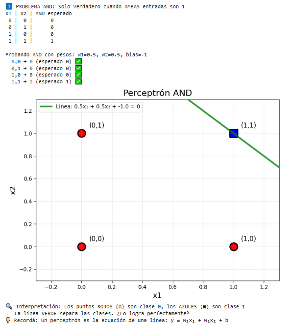

### **Evidencia 2** {#evidencia-2}

### **Evidencia 3** {#evidencia-3}

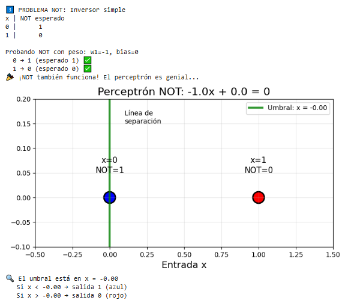

### **Evidencia 4** {#evidencia-4}

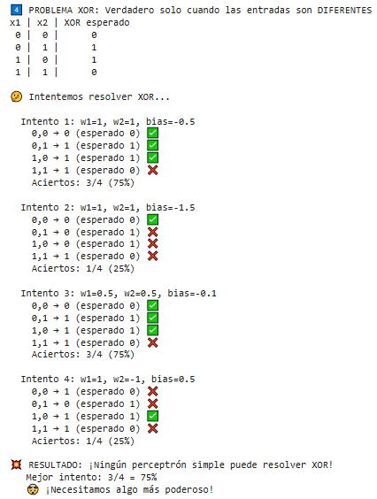

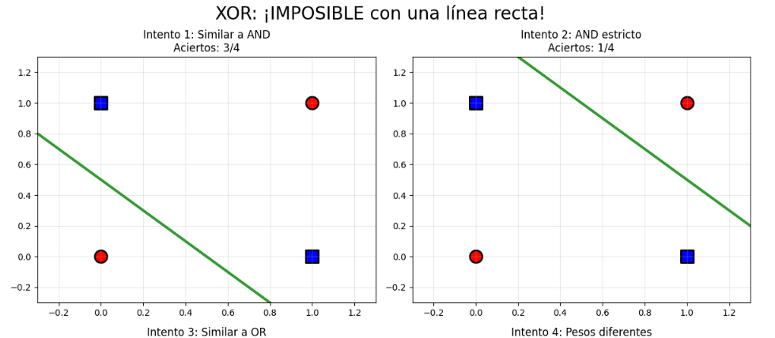

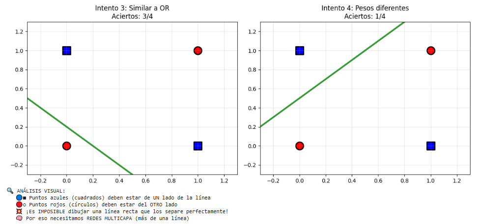

### **Evidencia 5** {#evidencia-5}

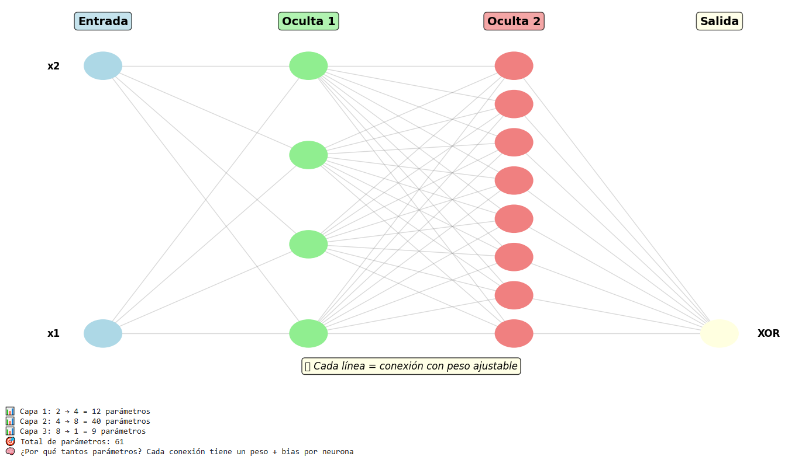

### **Evidencia 6** {#evidencia-6}

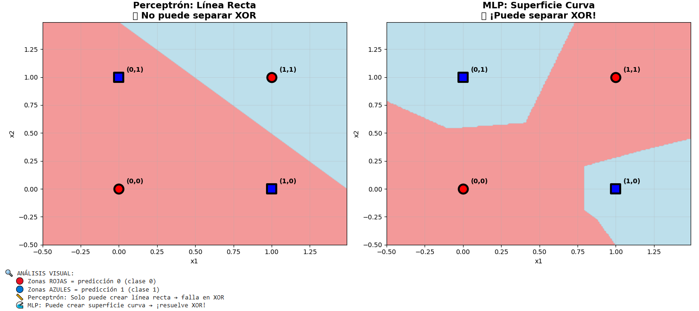

### **Evidencia 7** {#evidencia-7}

### **Evidencia 8** {#evidencia-8}

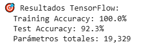

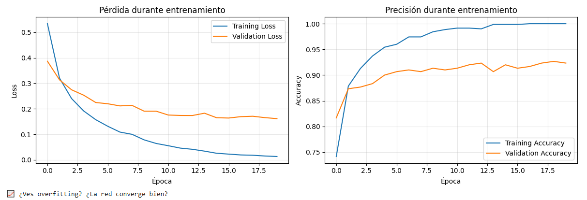

### **Evidencia 9** {#evidencia-9}

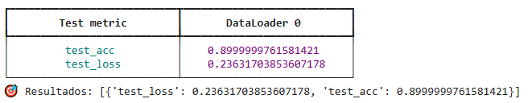

### **Evidencia 10** {#evidencia-10}

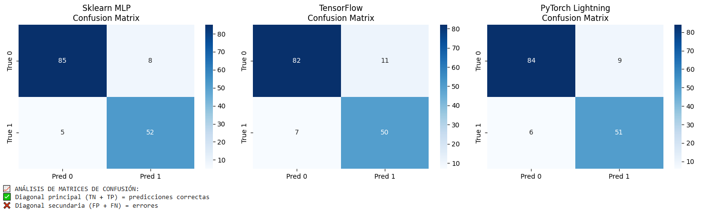

## **Conclusión**

En esta actividad pudimos ver distintos problemas lógicos básicos que conforman problemas más complejos y cómo los Perceptrones individuales se ven limitados ante la resolución de dichos problemas como puede ser el XOR. Exploramos distintas maneras de crear redes neuronales con Sklearn, TensorFlow y PyTorch Lightning, las cuales son opciones competitivas ([Evidencia 10](#evidencia-10)), ajustables y personalizables según el contexto que se maneje.

## **Referencias**

*Páctica 7: De Perceptrón a Redes Neuronales - Fundamentos del Aprendizaje Automático - Universidad Católica del Uruguay*. (n.d.). [https://juanfkurucz.com/ucu-ia/ut2/07-mlp-activaciones/](https://juanfkurucz.com/ucu-ia/ut2/07-mlp-activaciones/)

GeeksforGeeks. (2025, July 23). *What is Perceptron | The Simplest Artificial neural network*. GeeksforGeeks. [https://www.geeksforgeeks.org/machine-learning/what-is-perceptron-the-simplest-artificial-neural-network/](https://www.geeksforgeeks.org/machine-learning/what-is-perceptron-the-simplest-artificial-neural-network/)

*Google Colab*. (n.d.-e). https://colab.research.google.com/drive/1haI7tnZ6hqbrLHcPwM_dCewc9VQ6pTju?usp=sharing