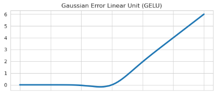
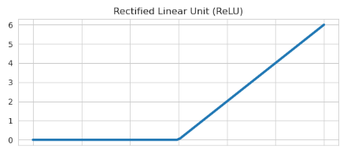
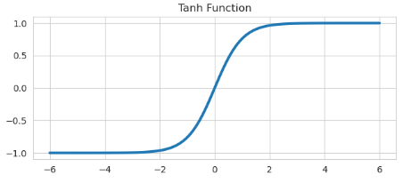
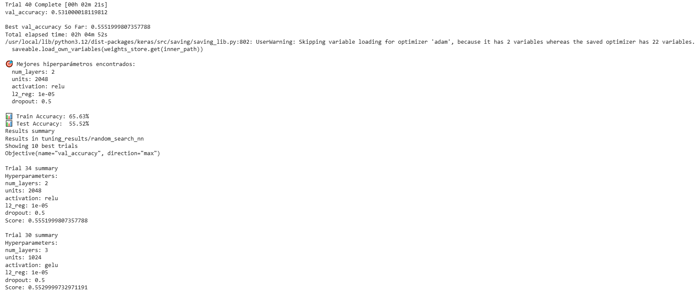

# Optimización de Redes Neuronales

| Title | Date |
| --- | --- |
| Optimización de Redes Neuronales | 12/10/25 |

# Optimización de Redes Neuronales

## **Contexto**

Las Redes Neuronales son modelos de Machine Learning extremadamente útiles por la posibilidad de ajustar y configurar para moldearse a cualquier problema de Inteligencia Artificial que se quiera resolver. Cuando nos enfrentamos a problemas complejos perdemos la utilidad de las mismas si no las configuramos de manera correcta o pasamos tiempo de más ajustándolas a mano. En esta actividad veremos cómo podemos automatizar y facilitar este proceso arduo de optimización de Redes Neuronales.

## **Objetivo**

- Crear una Red Neuronal
- Usar Grid Search junto a Keras Tuner para optimización
- Clasificar imágenes del dataset Cifar-10 de manera exitosa

## **Actividades**

- **PARTE 1: Setup**
    - Instalación de librerías y dataset (5 min)
- **PARTE 2: Optimización**
    - Armado del Grid Search (15 min)
    - Entrenamiento y optimización automatizada (80-180 min)

## **Desarrollo**

En esta actividad estaremos armando Redes Neuronales para clasificar imágenes del dataset Cifar-10. Este dataset tiene 60000 imágenes de aviones, automóviles, pájaros, gatos, ciervos, perros, ranas, caballos, barcos y camiones en tamaño de 32x32 a color (cada clase tiene 6000 fotos). Los datos están separados en 50000 imágenes de entrenamiento y el 10000 restante de prueba.

Lo que vamos a querer hacer es usar una Red Neuronal que use Computer Vision para poder analizar las imágenes y clasificarlas en las distintas clases. Identificar objetos dentro de una imagen no es una tarea simple, y menos aún cuando se tratan de imágenes de baja resolución. Sin embargo, lo que ganamos al usar imágenes de baja resolución es menos tiempo de procesamiento, ya que el modelo tendrá que procesar menos datos, lo cual nos es útil para agilizar el proceso de encontrar los parámetros ideales apara este dataset.

Una de las primeras consideraciones que debemos hacer para armar nuestra Red Neuronal es la estructura de la misma:

- Cantidad de capas (profundidad)
- Cantidad de Perceptrones por capa (ancho de capa)
- Activación de los Perceptrones (en este caso probaremos ReLU, GeLU y Tanh)
- Regularizador
- Porcentaje de los datos que se descartan por capa, o Dropout

Hay muchas más consideraciones a tener en cuenta para optimizar nuestra Red Neuronal a su punto más performante, pero esto ya es suficiente para encontrar un modelo que funcione lo suficientemente bien en un periodo de tiempo razonable (para cada modelo se puede probar distintos tipos de optimizadores con distintos parámetros, lo cual aumenta el tiempo de entrenamiento y optimización de manera exponencial).

Para las cantidad de capas probaremos de una sola capa a 5. Esto determina la profundidad de la Red Neuronal. Mayor profundidad puede dar mejores resultados, pero corre el riesgo de caer en overfitting.

En la cantidad de Perceptrones por capa usaremos exponenciales de 2, particularmente 64, 128, 256, 512, 1024 y 2048. Usamos estos valores ya que los procesadores, GPUs y TPUs están optimizados para trabajar con bloques de memoria de dichos tamaños, dado a que manejan una arquitectura binaria.

Las activaciones de Perceptrones que manejamos son las siguientes:

- ReLU (Rectified Lineal Unit), toma las entradas positivas y lleva las entradas negativas a 0. ([Evidencia 1](#evidencia-1)).
- GeLU (Gaussian Error Lineal Unit), introduce no-linealidad pesando las entradas basándose en la probabilidad bajo una distribución normal estandarizada. ([Evidencia 2](#evidencia-2)).
- Tanh (Hyperbolic Tangent), asigna todas las entradas a valores entre -1 y 1. ([Evidencia 3](#evidencia-3)).

El regularizador (que en este caso usamos L2) se usa para reducir el overfitting en el aprendizaje, penalizando los pesos grandes para que el modelo prefiera soluciones más simples y generales. Usamos valores pequeños: 0.00001, 0.00005 y 0.0001. Finalmente el Dropout sirve para “apagar” temporalmente Perceptrones al azar, para ayudar con reducir los riesgos de overfitting. Usamos 0%, 20%, 30% y 50% como valores para el entrenamiento.

Estos son muchos valores a tener en cuenta y muchas combinaciones posibles de configuraciones para nuestra Red Neuronal. Si el problema a resolver fuera menos costoso en términos de tiempo usaríamos Grid Search sin más, para encontrar la configuración más certera, dándonos los mejores datos posibles. A lo que nuestro procesamiento de datos en este ejercicio conlleva analizar imágenes, es un procesamiento lento y pesado, por lo cual no tenemos el tiempo ni los recursos para probar más de 10.000 combinaciones posibles.

Para resolver esto usamos keras_tuner para seleccionar configuraciones del montón al azar. No nos asegura que elijamos la mejor configuración, pero nos agiliza mucho el proceso de optimización. En este caso probaremos 40 configuraciones distintas, midiendo la puntería en los datos de validación. 

## **Evidencias**

### **Evidencia 1** {#evidencia-1}

### Evidencia 2 {#evidencia-2}

### Evidencia 3 {#evidencia-3}

### **Evidencia 4** {#evidencia-4}

## **Conclusión**

En esta actividad pudimos ver qué consideraciones tener en cuenta para el armado de una Red Neuronal, qué valores suelen ser útiles y cómo probarlos de manera automatizada para encontrar la mejor configuración posible.

En nuestro contexto no buscamos la mejor configuración posible a nivel general ya que conlleva mucho tiempo y costo, así que reducimos los parámetros a ajustar y la cantidad de configuraciones tomadas al azar. Finalmente encontramos una configuración que nos da por encima del 55% de la puntería, lo cual puede ser mejorado sin lugar a duda, pero aún así es más certero de lo que es erróneo. ([Evidencia 4](#evidencia-4)).

## **Referencias**

*Clase 6: Backpropagation y Optimizadores - Fundamentos del Aprendizaje Automático - Universidad Católica del Uruguay*. (n.d.-b). [https://juanfkurucz.com/ucu-ia/ut2/08-backpropagation-optimizadores/](https://juanfkurucz.com/ucu-ia/ut2/08-backpropagation-optimizadores/)

Wikipedia contributors. (2025, October 3). *Rectified linear unit*. Wikipedia. [https://en.wikipedia.org/wiki/Rectified_linear_unit](https://en.wikipedia.org/wiki/Rectified_linear_unit)

Contributors, P. (n.d.). *GELU*. [https://docs.pytorch.org/docs/stable/generated/torch.nn.GELU.html](https://docs.pytorch.org/docs/stable/generated/torch.nn.GELU.html)

GeeksforGeeks. (2025a, February 14). *TANH activation in neural network*. GeeksforGeeks. [https://www.geeksforgeeks.org/deep-learning/tanh-activation-in-neural-network/](https://www.geeksforgeeks.org/deep-learning/tanh-activation-in-neural-network/)

Tanner, G. (n.d.). *Activation functions*. Machine Learning Explained. [https://ml-explained.com/blog/activation-functions-explained](https://ml-explained.com/blog/activation-functions-explained)

*Google Colab*. (n.d.-f). [https://colab.research.google.com/drive/1QnRCHiXMWPbozR-MDgYgTXGPnCjhv7yz?usp=sharing](https://colab.research.google.com/drive/1QnRCHiXMWPbozR-MDgYgTXGPnCjhv7yz?usp=sharing)