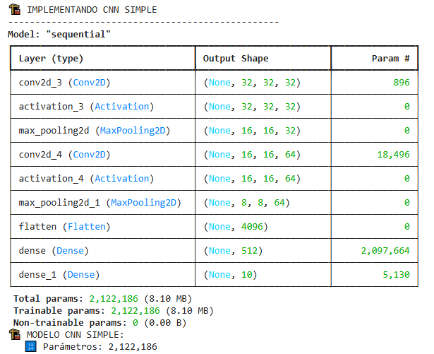
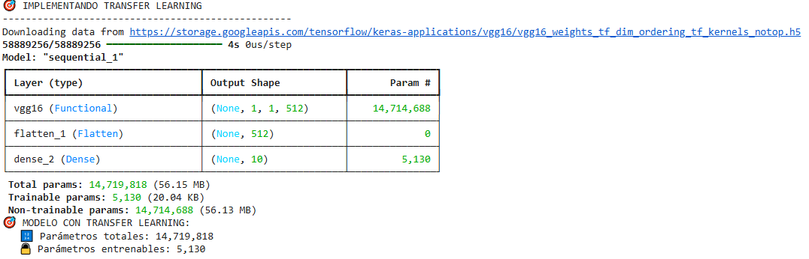
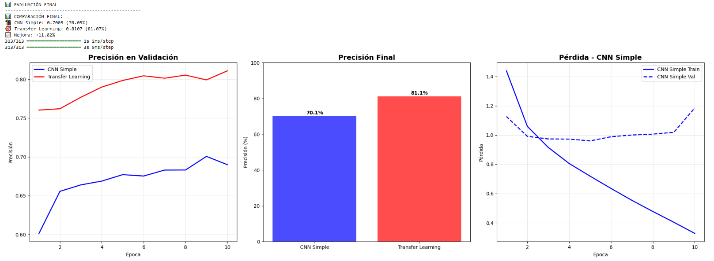
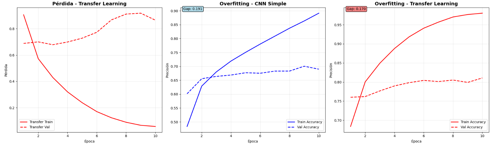

# Redes Neuronales Convolucionales y Transfer Learning

| Title | Date |
| --- | --- |
| Redes Neuronales Convolucionales y Transfer Learning | 05/11/25 |

# Redes Neuronales Convolucionales y Transfer Learning

## **Contexto**

En este trabajo exploraremos dos enfoques fundamentales en visión por computador: construiremos desde cero una red neuronal convolucional (CNN) y, por otra parte, aplicaremos la técnica de transfer learning utilizando modelos preentrenados. Usaremos el dataset CIFAR‑10 (10 clases de objetos comunes) y la librería TensorFlow/Keras, prepararemos los datos, diseñaremos una CNN simple, y luego reutilizaremos un modelo ya entrenado para adaptarlo al nuevo problema. Finalmente compararemos ambos resultados en cuanto a precisión, sobreajuste y complejidad del modelo.

## **Objetivos**

- **Implementar CNNs** usando TensorFlow/Keras para clasificación de imágenes
- **Aplicar Transfer Learning** con modelos pre-entrenados de Keras Applications
- **Procesar datasets** de imágenes con ImageDataGenerator
- **Evaluar modelos** usando métricas de clasificación
- **Comparar arquitecturas** CNN vs Transfer Learning

## **Actividades**

- **Parte 1: Setup y Configuración**
- **Paso 2: Preparar Dataset CIFAR-10**
- **Paso 3: CNN Simple desde Cero**
- **Paso 4: Transfer Learning con timm**
- **Paso 5: Entrenamiento**
- **Paso 6: Evaluación y Comparación**

## **Desarrollo**

En esta actividad estaremos usando redes neuronales convolucionales (o CNNs en inglés), las cuales son un tipo de red diseñada especialmente para procesar datos con una estructura en forma de cuadrícula, como las imágenes. Su arquitectura se basa en capas de convolución que aplican filtros sobre la imagen para detectar características locales (bordes, texturas, formas, entre otras) y, a medida que se avanza por las capas, combinan esas características en representaciones cada vez más abstractas. Este enfoque busca imita el funcionamiento del sistema visual humano y permite que las CNN aprendan automáticamente qué patrones son relevantes para tareas como el reconocimiento de objetos, la clasificación de imágenes o la detección de rostros, sin requerir una extracción manual de características.

El entrenamiento de redes convolucionales implica realizar millones de operaciones matemáticas en paralelo, especialmente multiplicaciones de matrices y convoluciones. Por esto, durante esta actividad estaremos usando tarjetas gráficas (GPUs) en lugar de procesadores centrales (CPUs). Las GPUs están diseñadas para ejecutar miles de tareas pequeñas de forma simultánea, lo que acelera enormemente el cálculo de los gradientes y la actualización de los pesos durante el entrenamiento. En contraste con una CPU que puede tener unos pocos núcleos optimizados para tareas secuenciales, una GPU cuenta con miles de núcleos que pueden procesar grandes volúmenes de datos en paralelo, reduciendo el tiempo de entrenamiento de días o semanas a horas o incluso minutos.

Con esto en mente, es crucial para la eficiencia de la actividad que nuestro amiente de entrenamiento tenga una tarjeta gráfica. Si el lector desea usar los scripts utilizados en esta actividad y no tiene una, puede usar Google Colab como una alternativa, que da la opción de hacer uso de una tarjeta gráfica de manera totalmente gratuita.

En este bloque de código se prepara el dataset CIFAR-10, un conjunto de 60.000 imágenes pequeñas (32×32 píxeles) distribuidas en 10 categorías distintas, que se usa habitualmente para entrenar y evaluar modelos de clasificación de imágenes. Primero se cargan los datos y se separan en conjuntos de entrenamiento y prueba. Luego, las imágenes —cuyos valores de píxeles originalmente van de 0 a 255— se normalizan dividiendo por 255, lo que convierte cada valor a un rango entre 0 y 1. 

Esta normalización es importante porque ayuda a que la red neuronal entrene de forma más estable y eficiente: al mantener los valores en una escala acotada, se evita que los gradientes se vuelvan demasiado grandes o pequeños durante la retropropagación, lo que mejora la convergencia del modelo. 

En términos prácticos, esto significa que la red procesará las imágenes en una escala uniforme, facilitando que los pesos se ajusten de manera equilibrada y reduciendo la posibilidad de errores numéricos. Finalmente, las etiquetas se transforman a formato one-hot encoding para que el modelo pueda interpretar las clases como vectores binarios, se definen los nombres de las clases y se configura el tamaño de los batches usados en el entrenamiento.

Para nuestra primera red usaremos dos bloques convolucionales, donde cada uno tiene una capa de convolución, una activación ReLU y una capa de max pooling, para extraer características visuales de las imágenes. Luego las salidas son aplanadas y pasadas por capas densas que funcionan como clasificador, usando una activación softmax para obtener posibilidades sobre las 10 clases posibles. Finalmente el modelo se complica con el optimizador Adam y la función de pérdida categorical crossentropy ([Evidencia 1](#evidencia-1)).

Luego vamos a usar transfer learning para armar una nueva red neuronal convolucional. Para esta ocación usamos el modelo VGG16, el cual está preentrenado en el conjunto de datos ImageNet. Hacer esto nos es más eficiente, ya que podemos aprovechar de los pesos previamente aprendidos por VGG16 para extraer características visuales generales de las imágenes, lo que acelera el entrenamiento y mejora la precisión con pocos datos. Las capas convolucionales del modelo base se congelan para mantener sus parámetros fijos, y se añaden capas densas finales que aprenden a clasificar las imágenes en las 10 categorías específicas del nuevo problema. Finalmente, el modelo se compila con un learning rate más bajo (0.001) para ajustar suavemente las nuevas capas sin alterar los pesos preentrenados, y se muestran la arquitectura y la cantidad de parámetros totales y entrenables ([Evidencia 2](#evidencia-2)).
Para mejorar la capacidad de clasificación del modelo se puede aplicar fine-tuning, descongelando algunas de las últimas capas de la red. Esto permite que la red mantenga fijos los pesos de las capas iniciales (que capturan características generales) mientras reajusta los pesos de las capas finales para adaptarse mejor al nuevo conjunto de datos. Con este pequeño ajuste se logra refinar el aprendizaje del modelo y obtener mejores resultados de precisión.
Con ambas redes armadas podemos pasar al entrenamiento con las imágenes del dataset CIFAR-10. 

## **Evidencias**

### **Evidencia 1** {#evidencia-1}

### **Evidencia 2** {#evidencia-2}

### **Evidencia 3** {#evidencia-3}

## **Reflexión**

En esta actividad pudimos crear redes neuronales convolucionales desde cero y usando transfer learning para procesar imágenes del dataset CIFAR-10. En un nivel teórico vimos que usar transfer learning nos es útil cuando los datos con los que estamos trabajando no son numerosos, como puede ser este caso; lo cual se ve reflejado en las comparaciones de precisión y pérdida de ambas redes ([Evidencia 3](#evidencia-3)). No solo vemos que transfer learning nos dio mejores resultados para este caso, sino que vemos que durante el aprendizaje hace una mejoría gradual (o "suave", sin saltos grandes o variaciones), con mayor estabilidad que nuestra red neuronal convolucional creada desde cero. Vale la pena volver a remarcar lo útil que es usar transfer learning con fine tuning a la hora de manejar datasets con volúmenes de datos o recursos reducidos, por las ventajas de tiempo y rendimiento que nos brinda.

## **Referencias**

*Assignment UT3-9: CNNs y Transfer Learning con TensorFlow/Keras - Fill in the Blanks - Fundamentos del Aprendizaje Automático - Universidad Católica del Uruguay*. (n.d.). [https://juanfkurucz.com/ucu-ia/ut3/09-cnn-transfer-learning-assignment/](https://juanfkurucz.com/ucu-ia/ut3/09-cnn-transfer-learning-assignment/)

*CIFAR-10 and CIFAR-100 datasets*. (n.d.). [https://www-cs-toronto-edu.translate.goog/~kriz/cifar.html?_x_tr_sl=en&_x_tr_tl=es&_x_tr_hl=es&_x_tr_pto=tc](https://www-cs-toronto-edu.translate.goog/~kriz/cifar.html?_x_tr_sl=en&_x_tr_tl=es&_x_tr_hl=es&_x_tr_pto=tc)

*Google Colab*. (n.d.-j). [https://colab.research.google.com/drive/10_qI4DS2zZs-cAquVrE6zZUrCG0Xs8z2?usp=sharing](https://colab.research.google.com/drive/10_qI4DS2zZs-cAquVrE6zZUrCG0Xs8z2?usp=sharing)