# SAM para monitreo de desastres y respuesta a emergencias

| Title | Date |
| --- | --- |
| SAM para monitreo de desastres y respuesta a emergencias | 09/11/25 |

# SAM para monitreo de desastres y respuesta a emergencias

## **Contexto**

En esta actividad exploraremos la segmentación de imágenes mediante el modelo Segment Anything Model (SAM), una arquitectura avanzada para detectar y delinear con precisión objetos en imágenes, más allá de la simple detección de cajas. Aprenderemos a aplicar SAM sobre un conjunto de datos de imágenes de inundaciones, generar máscaras de segmentación para las zonas inundadas y evaluar la calidad de dichas máscaras, manejando un caso de negocio real (flood segmentation para disaster monitoring y respuesta a emergencias).

## **Objetivos**

- Implementar segmentación con Segment Anything Model (SAM),
- Comparar performance de pretrained SAM zero-shot vs fine-tuned SAM .

## **Actividades**

- **Parte 1: Setup**
- **Parte 2: SAM pre-entrenado**
- **Parte 3: Fine-tuning**
- **Parte 4: Evaluación y comparación**

## **Desarrollo**

Vamos a utilizar el dataset de Kaggle Flood Area Segmentation, el cual contiene imágenes reales de inundaciones junto con sus correspondientes máscaras (imágenes que indican las zonas donde hay agua) ([Evidencia 1](#evidencia-1)). Gracias a esto, contamos con un objetivo o "target" que nos permitirá evaluar el desempeño de nuestro modelo SAM (Segment Anything Model). Este modelo generará sus propias máscaras de segmentación, que luego podremos superponer y comparar con las máscaras originales para medir qué tan bien logra identificar las áreas inundadas.

Para empezar con SAM crearemos un predictor de segmentación, que sirve para segmentar A de B, lo que en este caso sería el agua del resto (casas, vegetación y demás). A esto le llamaremos máscara binaria. Estaremos usando un mecanismo de segmentación guiada por puntos, donde le pasamos una o más coordenadas dentro de la imagen y el modelo nos dará la máscara binara que delimita la región del objeto asociado a dichos puntos. Luego, para evaluar el desempeño, tomamos el punto central de la zona inundada como referencia y luego se ejecuta la predicción de máscara con SAM ([Evidencia 2](#evidencia-2)).

Además podemos probar de usar el mismo mecanismo guiado, pero con cajas en vez de puntos. Esta vez tendremos 4 coordenadas que marcan los vértices de la caja. SAM vuelve a generar la máscara binaria dentro de esa región y devuelve un puntaje de confianza ([Evidencia 3](#evidencia-3)).

Para medir la calidad de las máscaras generadas utilizaremos varias métricas ([Evidencia 4](#evidencia-4)):

- **IoU (Intersection over Union)**: mide la superposición entre la máscara predicha y la real, dividiendo el área de intersección entre ambas por el área de su unión. Cuanto más alto el IoU, más se parecen las dos máscaras. Un IoU de 1 es que ambas son idénticas y un IoU de 0 es que las máscaras no se superponen.
- **Dice Coefficient**: similar al IoU, pero da más peso a los píxeles correctamente identificados. Es útil especialmente cuando las regiones positivas son pequeñas (por ejemplo, zonas de agua en una imagen grande).
- **Precision (Precisión)**: indica qué proporción de los píxeles que el modelo marcó como “objeto” realmente lo son. Evalúa la exactitud de las detecciones.
- **Recall (Exhaustividad o Sensibilidad)**: mide cuántos de los píxeles del objeto real fueron correctamente detectados por el modelo. Evalúa la cobertura del objeto.

Para poder entrenar y evaluar a SAM con nuestro conjunto de datos, primero necesitamos preparar las imágenes y sus máscaras para que puedan ser utilizadas por el modelo. Para ello, definimos una clase personalizada llamada FloodSegmentationDataset, la cual se encarga de procesar y organizar los datos antes de pasarlos a la red ([Evidencia 5](#evidencia-5)).

Esta clase toma como entrada las imágenes y sus máscaras, aplicando una serie de transformaciones necesarias para mantener coherencia en el tamaño y formato. Todas las imágenes se redimensionan a 1024x1024 píxeles, que es el tamaño nativo de SAM, de manera que puedan ser agrupadas en lotes (batches) durante el entrenamiento. También permite aplicar aumentos de datos (data augmentation), como giros horizontales o verticales, rotaciones y ajustes de brillo o contraste. Esto ayuda a que el modelo generalice mejor frente a distintas condiciones visuales, como cambios de iluminación o perspectiva.

Cada muestra del dataset incluye tanto la imagen como su máscara binaria, y además incorpora un prompt o “señal de guía” que indica al modelo qué región debe segmentar. Dependiendo del modo de trabajo, este prompt puede ser un punto dentro de la zona inundada, para que SAM genere una máscara alrededor de esa región, o una caja delimitadora (bounding box), que encierra el área donde se espera encontrar agua. Si la imagen no contiene zonas de inundación, se define un punto neutro en el centro de la imagen para que el modelo aprenda a distinguir entre regiones positivas (agua) y negativas (sin agua).

Una vez preparado el dataset, se divide el conjunto total en un 80 % para entrenamiento y un 20 % para validación, lo que permite evaluar el modelo con imágenes que no ha visto previamente. Luego se crean los DataLoaders, que son los encargados de entregar los datos al modelo en lotes pequeños y de forma paralela, optimizando el uso de memoria y acelerando el proceso de entrenamiento.

Finalmente, se definen las funciones de pérdida (loss functions), que son las que cuantifican el error entre la máscara predicha por SAM y la máscara real del dataset. En este caso se utilizan dos:

- **Dice Loss**, que mide la coincidencia entre ambas máscaras y es especialmente útil en tareas donde las zonas de interés son pequeñas.
- **Binary Cross Entropy (BCE)**, que evalúa la precisión píxel a píxel.

Ambas se combinan en una única función de pérdida que aprovecha las ventajas de cada una. De esta forma, el modelo aprende no solo a identificar correctamente los píxeles individuales, sino también a generar máscaras más coherentes en su forma y extensión. Con esta preparación completada, el modelo queda listo para ser aplicado fine-tuning e iniciar el proceso de entrenamiento, utilizando los datos de inundaciones como referencia para aprender a segmentar automáticamente las zonas de agua en nuevas imágenes.

Con los parámetros ajustados para el entrenamiento con fine-tuning corremos varias épocas (epochs) y nos quedamos con el modelo que dé mejor IoU ([Evidencia 5](#evidencia-5)). Con el modelo ajustado, podemos comparar resultados con el modelo original ([Evidencia 6](#evidencia-6)), donde podemos ver como, una vez más, hacer uso de fine-tuning nos da resultados de mejor calidad en toda métrica. Además, podemos ver imágenes comparativas de ambos modelos y las máscaras que generan, para ver la diferencia a nivel visual ([Evidencia 7](#evidencia-7)). Por último, podemos visualizar ocasiones en las cuales nuestros modelos fallan en encontrar las zonas inundadas de manera efectiva ([Evidencia 8](#evidencia-8)).

## **Evidencias**

### **Evidencia 1** {#evidencia-1}

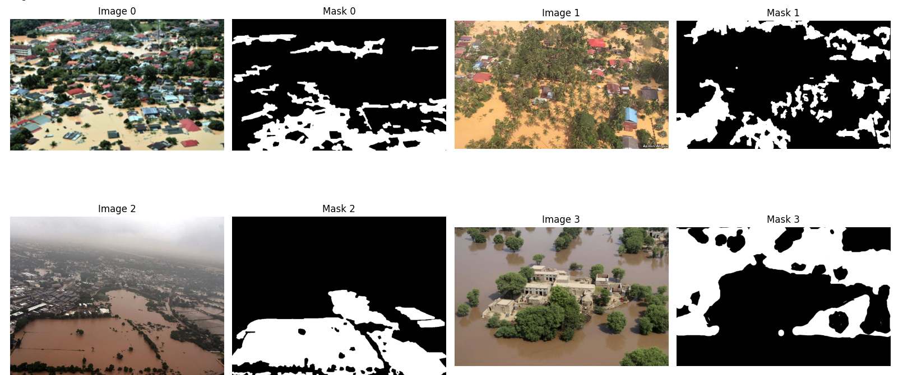

### **Evidencia 2** {#evidencia-2}

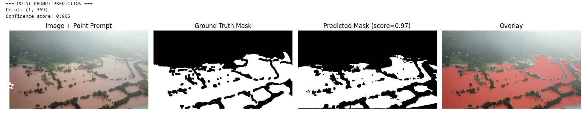

### **Evidencia 3** {#evidencia-3}

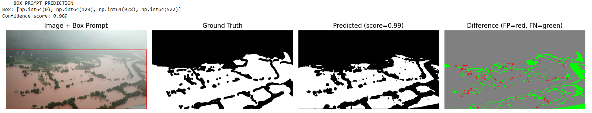

### **Evidencia 4** {#evidencia-4}

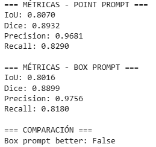

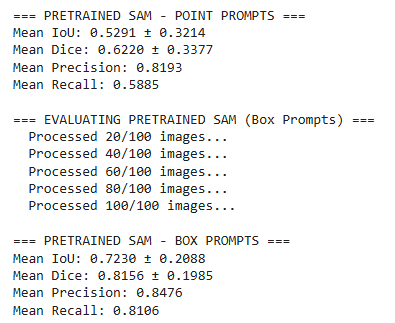

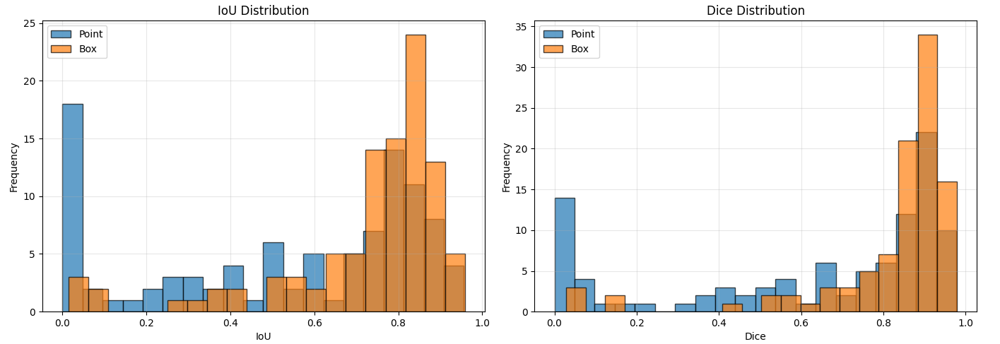

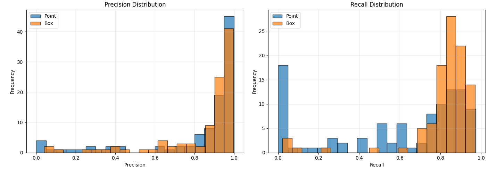

### **Evidencia 5** {#evidencia-5}

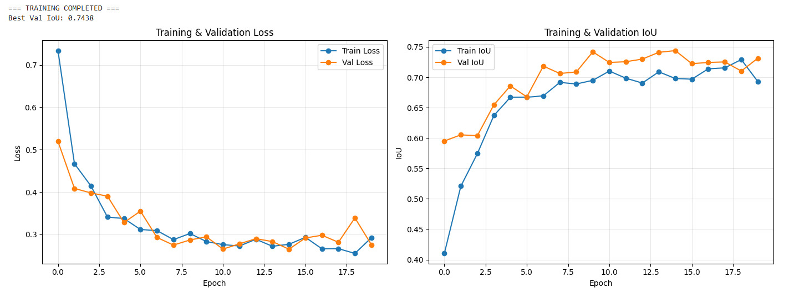

### **Evidencia 6** {#evidencia-6}

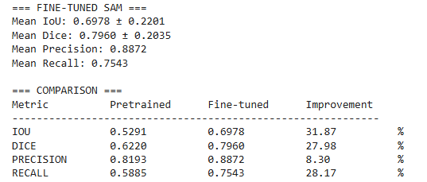

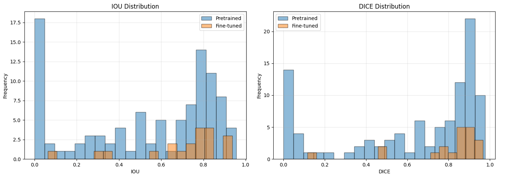

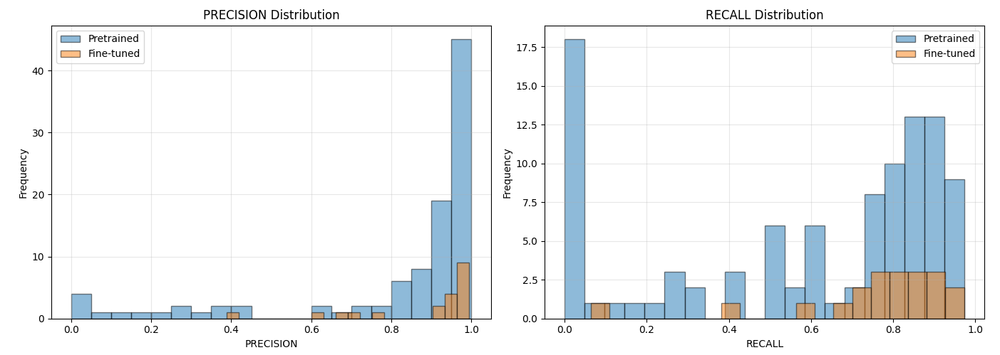

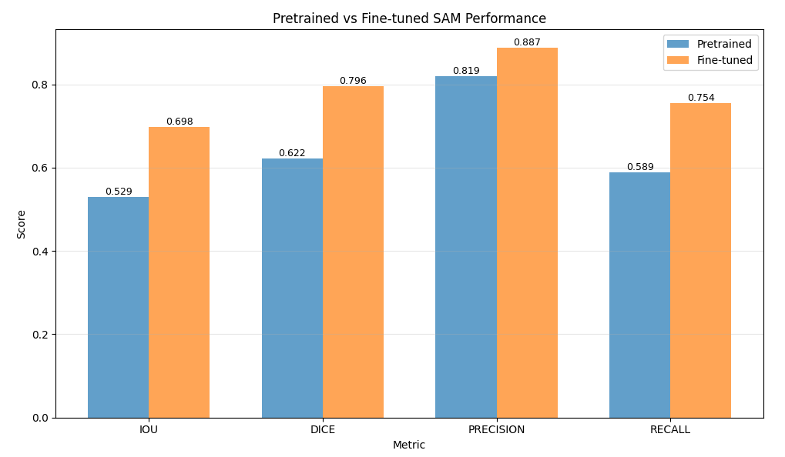

### **Evidencia 7** {#evidencia-7}

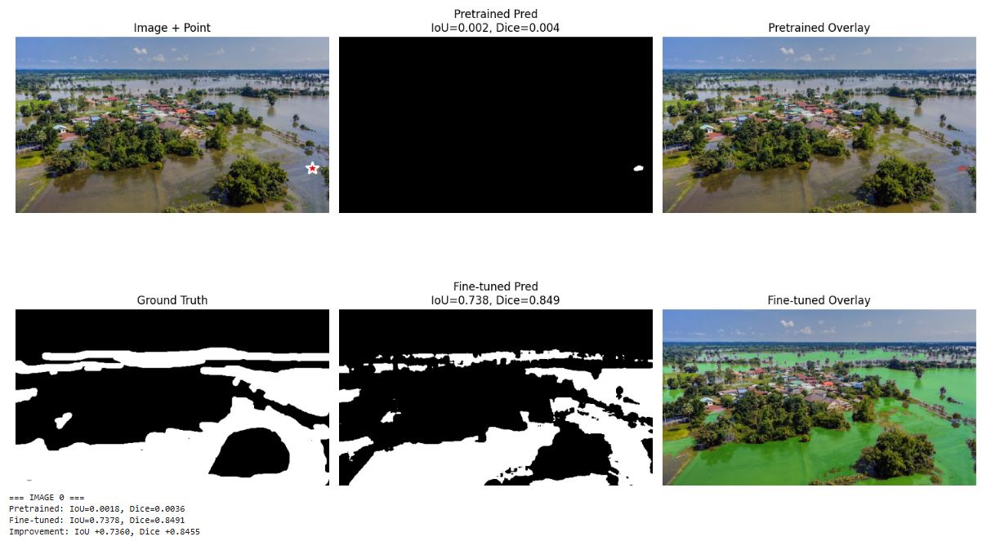

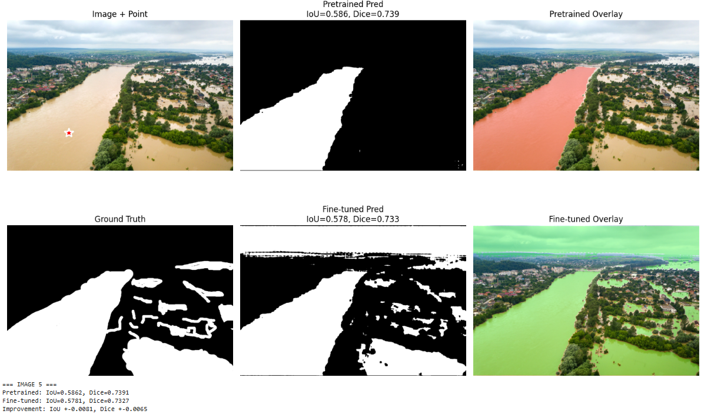

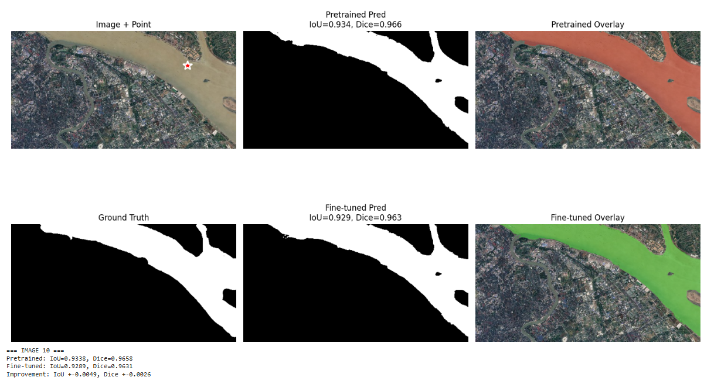

### **Evidencia 8** {#evidencia-8}

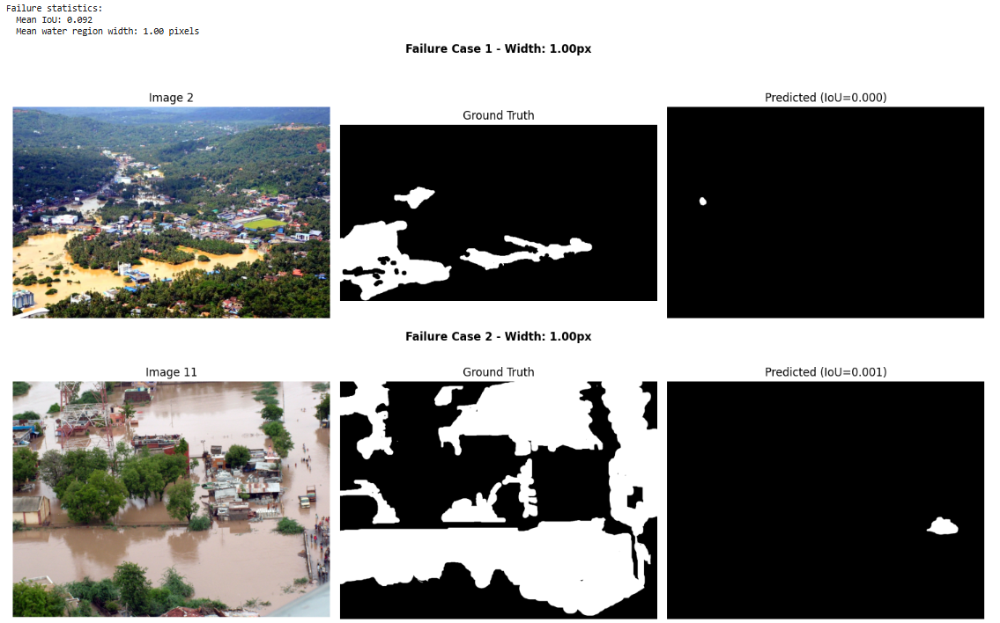

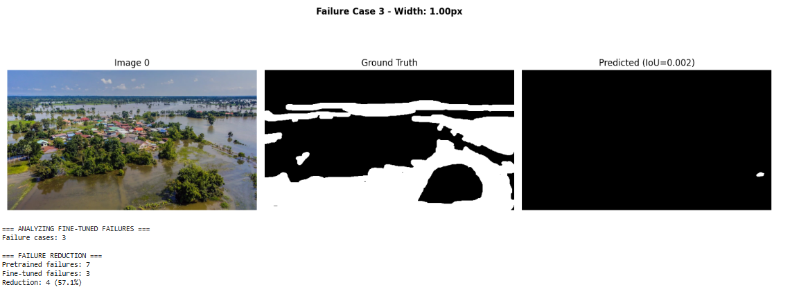

## **Reflexión**

En esta actividad pudimos hacer uso de Segment Anything Model (SAM) para generar máscaras en imágenes de inundaciones para determinar las regiones de las mismas que muestran agua. Usamos distintas técnicas y métricas para generar máscaras y medir la calidad de ellas, acompañado de imágenes superpuestas para poder apreciar de manera visual el rendimiento de nuestro modelo.

## **Referencias**

*Clase 10: SAM Segmentation - Pretrained vs Fine-tuned - Fundamentos del Aprendizaje Automático - Universidad Católica del Uruguay*. (n.d.). [https://juanfkurucz.com/ucu-ia/ut3/12-sam-segmentation-assignment/](https://juanfkurucz.com/ucu-ia/ut3/12-sam-segmentation-assignment/)

*Flood area segmentation*. (2022, December 16). Kaggle. [https://www.kaggle.com/datasets/faizalkarim/flood-area-segmentation](https://www.kaggle.com/datasets/faizalkarim/flood-area-segmentation)

Facebookresearch. (n.d.). *GitHub - facebookresearch/segment-anything: The repository provides code for running inference with the SegmentAnything Model (SAM), links for downloading the trained model checkpoints, and example notebooks that show how to use the model.* GitHub. [https://github.com/facebookresearch/segment-anything](https://github.com/facebookresearch/segment-anything)

*Google Colab*. (n.d.-g). [https://colab.research.google.com/drive/1PfTSHN6BuEyqNd4BTgHxwcKU7oaN_yJv?usp=sharing](https://colab.research.google.com/drive/1PfTSHN6BuEyqNd4BTgHxwcKU7oaN_yJv?usp=sharing)