# YOLO y Norfair, detección y tracking de frutas

| Title | Date |
| --- | --- |
| YOLO y Norfair, detección y tracking de frutas | 09/11/25 |

# YOLO y Norfair, detección y tracking de frutas

## **Contexto**

En esta actividad exploraremos la detección de objetos con el modelo YOLOv8, comenzando con su uso “tal cual” (pre-entrenado) y luego refinándolo para un caso de uso específico: productos en estantes de supermercado y cintas transportadoras. Le haremos fine-tuning al modelo en un conjunto de datos de frutas/productos y luego a aplicarlo en vídeo para implementar tracking de objetos en movimiento. Esta fase combina detección, evaluación de métricas (como mAP, precisión y recall) y seguimiento de objetos en secuencia para resolver un problema real de visión por computador con impacto en inventario y ventas.

## **Objetivos**

- Implementar inferencia con YOLOv8 pre-entrenado
- **Fine-tune YOLOv8** en dataset de productos de grocery
- Evaluar mejoras con métricas (mAP, Precision, Recall)
- Analizar errores (FP, FN) antes y después del fine-tuning
- Implementar **tracking con modelo fine-tuned** en video

## **Actividades**

- **Parte 1: Setup**
- **Parte 2: Fine-tuning YOLOv8 en Fruit Detection Dataset**
- **Parte 3: Tracking con Modelo Fine-tuned**

## **Desarrollo**

Como vimos en las actividades anteriores, los problemas de Computer Vision suelen abordarse mediante Redes Neuronales Convolucionales (CNNs), las cuales permiten extraer características clave de las imágenes para tareas como clasificación o detección de objetos. En esta actividad nos centraremos en la segunda, implementando un modelo de detección de objetos con YOLOv8 (You Only Look Once, versión 8), una arquitectura moderna que realiza detección en tiempo real al predecir simultáneamente las clases y posiciones de los objetos dentro de una imagen. Para adaptar el modelo a nuestro caso de estudio, aplicaremos fine-tuning sobre el dataset de productos de supermercados (groceries), optimizando así su rendimiento para este dominio específico.

Estaremos haciendo detección de objetos con YOLOv8, utilizando un modelo pre-entrenado sobre el dataset COCO, el cual contiene miles de imágenes de objetos comunes. Para esta actividad vamos a usar la versión nano del modelo (yolov8n.pt), que es la más ligera y rápida. Queremos hacer pruebas iniciales donde no queremos obtener los mejores resultados posibles a nivel teórico, por lo cual, el incremento de velocidad nos es más importante que el incremento en precisión. En nuestra primera fase de detección (sin fine-tuning hecho) podemos ver qué identificó el modelo, con sus etiquetas, probabilidad de certeza y bounding box (o caja delimitadora) ([Evidencia 1](#evidencia-1)).

El modelo base pre-entrenado con el dataset COCO presenta limitaciones al trabajar con imágenes de productos de supermercado, ya que este conjunto de datos contiene solo un número reducido de clases relacionadas con alimentos o frutas. Como se observa en la evidencia ([Evidencia 1](#evidencia-1)), el modelo tiende a confundir objetos (clasifica verduras anaranjadas como naranjas y verdosas como brócoli, cuando no son ninguna de las dos) por la falta de ejemplos específicos. Para mejorar la precisión en estos casos (frutas), descargamos un nuevo dataset especializado en frutas desde Kaggle, el Fruit Detection Dataset, que servirá para realizar el fine-tuning del modelo. De esta manera, el modelo aprenderá a reconocer con mayor exactitud los productos reales que se espera detectar en un entorno de supermercado ([Evidencia 2](#evidencia-2)). Este nuevo dataset, como dice el nombre, tiene imágenes de frutas de distintos tipos (manzana, banana, uva, naranja, ananá y sandía) ([Evidencia 2](#evidencia-2)). A continuación podemos ver imágenes representativas del dataset ([Evidencia 3](#evidencia-3)).

Como podemos ver, el modelo está pudiendo identificar efectivamente las frutas, pero no sus ubicaciones en la imagen (sus cajas no abarcan la fruta entera). Como vimos en la actividad previa, el uso de fine-tuning es crucial para usar con éxito modelos pre-entrenados, como es YOLOv8. Necesitamos hacer estos ajustes, ya que queremos aprovechar todo el aprendizaje masivo que tiene el modelo, aplicado a nuestro caso específico. Un ejemplo práctico de fine-tuning, es como un historiador que tiene muchos conceptos históricos aprendidos y se le da un caso en particular para estudiar; sus conocimientos previos van a hacer que el aprendizaje del caso sean mucho más eficiente, dando resultados ricos y precisos. Nosotros lo que haremos con nuestro modelo es descongelar algunas de las últimas capas para "re-aprender" conocimientos, reteniendo la mayoría del aprendizaje previo mientras lo ajustamos a nuestros nuevos datos ([Evidencia 4](#evidencia-4)).

Con ambos modelos entrenados, podemos pasar a comparar sus resultados. Podemos ver que el modelo que le fue aplicado fine-tuning con el dataset de frutas suele detectar las frutas de mejor manera, clasificándolas correctamente, con mayor seguridad y con mejor precisión a la hora de marcarlas en la imagen ([Evidencia 5](#evidencia-5) y [7](#evidencia-7)). Sin embargo, podemos ver como el modelo con el fine-tuning aún así se confunde a la hora de categorizar frutas ([Evidencia 6](#evidencia-6)). Aún así, la mejoría es total, ya que el modelo sin fine-tuning (en nuestro caso de prueba) no acertó ni una sola vez ([Evidencia 8](#evidencia-8)).

Ahora que contamos con un modelo capaz de detectar objetos en imágenes, podemos avanzar hacia un problema de Computer Vision: el Object Tracking. Este consiste en extender la detección de objetos (Object Detection o Segmentation) al dominio de los videos. El desafío principal está en mantener la identidad de cada objeto a lo largo del tiempo, es decir, “trackearlo” sin confundirlo con nuevos objetos que aparezcan en el mismo video. Para afrontar este problema utilizaremos Norfair, una librería especializada en tracking que emplea filtros de Kalman para predecir el movimiento de los objetos entre fotogramas. Vale recordar que, desde un punto de vista visual, un video no es más que una sucesión de imágenes estáticas mostradas de forma continua. 

Una ventaja de Norfair es la capacidad “plug-and-play” que tiene, ya que solo debemos darle algunos parámetros como el umbral para detectar un objeto, la cantidad de fotogramas que pueden pasar antes de eliminar la detección, una función para determinar la distancia entre detecciones y la cantidad de fotogramas necesarios para confirmar un nuevo track. Luego lo corremos con el modelo que le hicimos fine-tuning y podremos ver qué tan bien funcionó.

## **Evidencias**

### **Evidencia 1** {#evidencia-1}

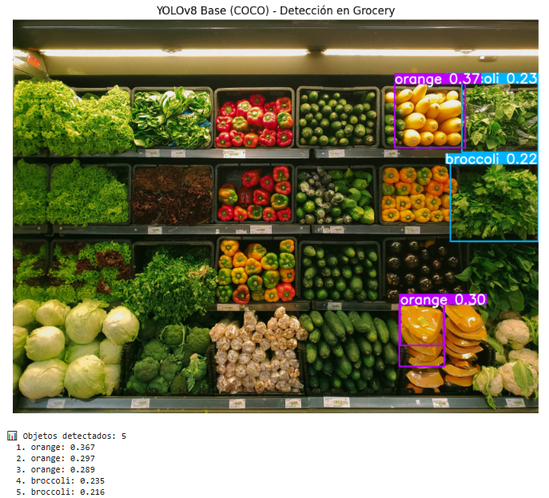

### **Evidencia 2** {#evidencia-2}

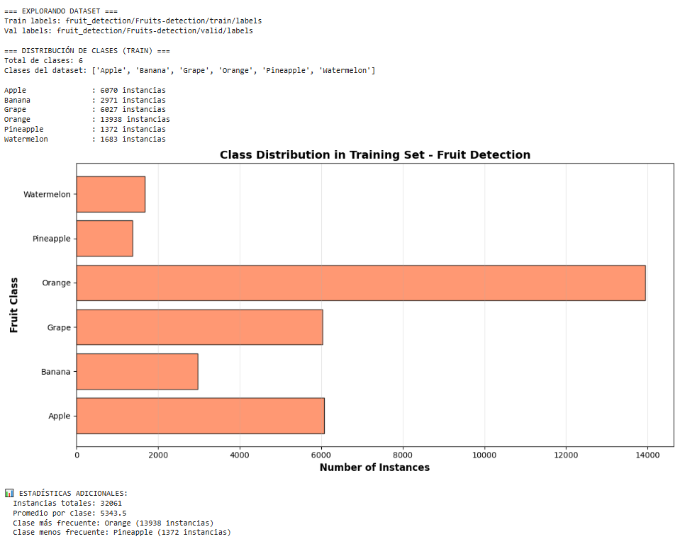

### **Evidencia 3** {#evidencia-3}

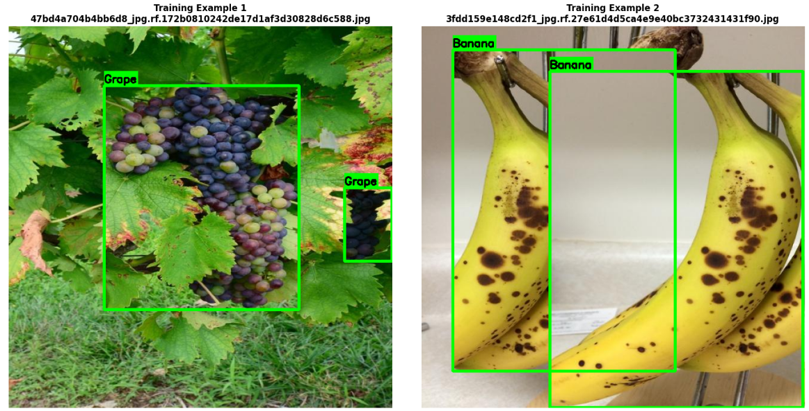

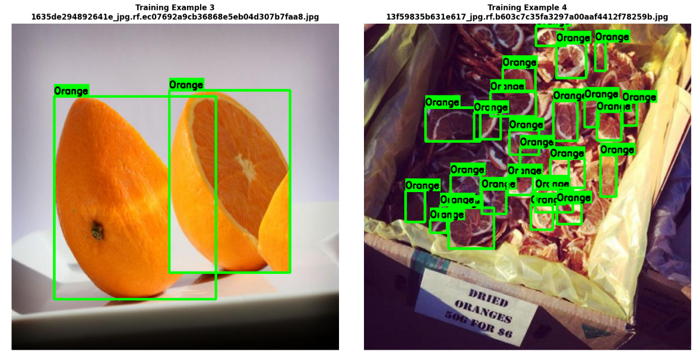

### **Evidencia 4** {#evidencia-4}

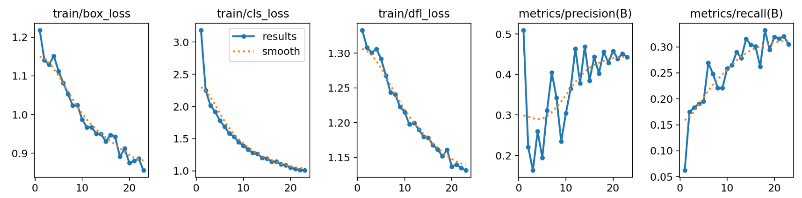

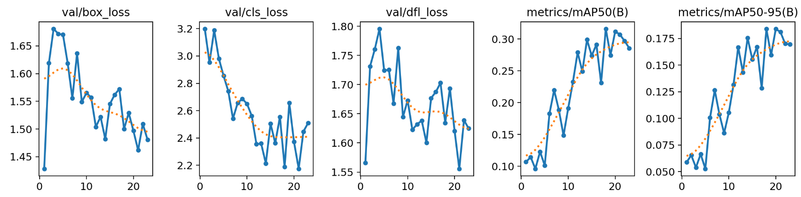

### **Evidencia 5** {#evidencia-5}

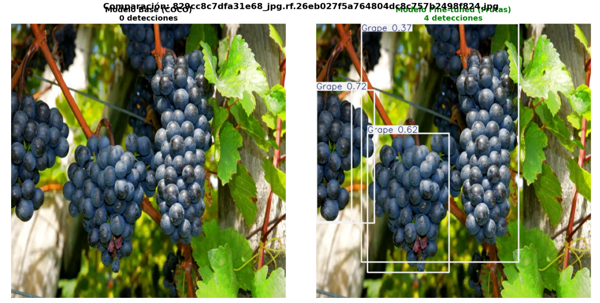

### **Evidencia 6** {#evidencia-6}

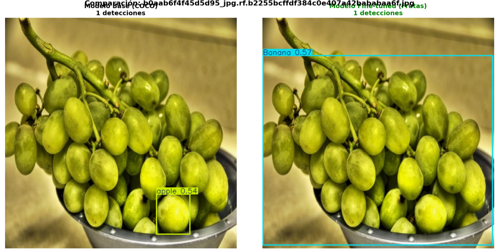

### **Evidencia 7** {#evidencia-7}

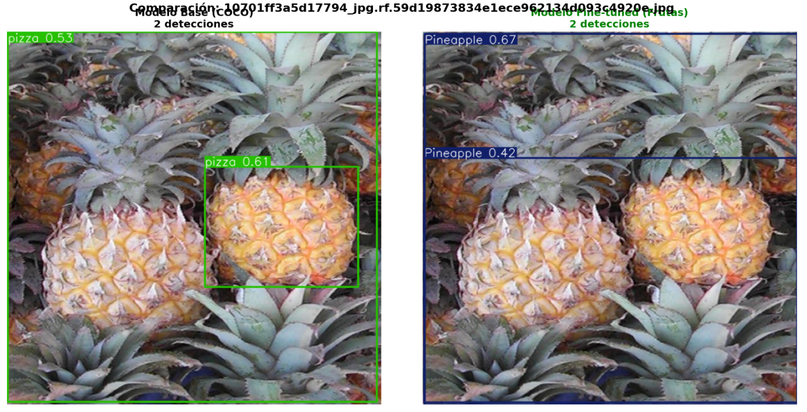

### **Evidencia 8** {#evidencia-8}

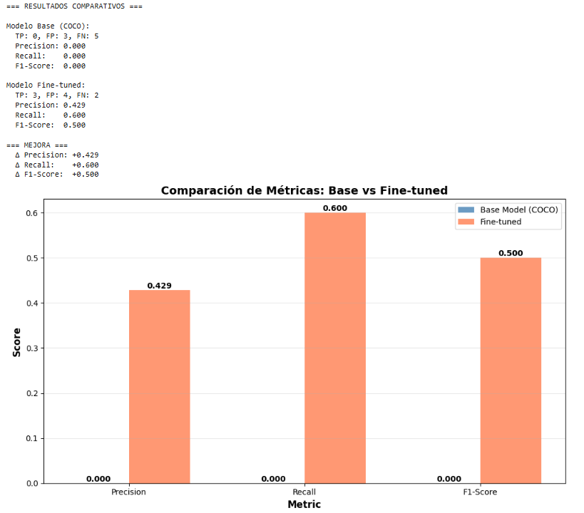

### **Evidencia 9** {#evidencia-9}

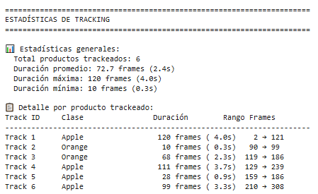

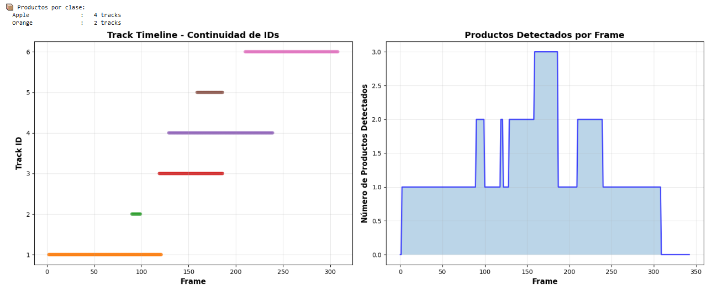

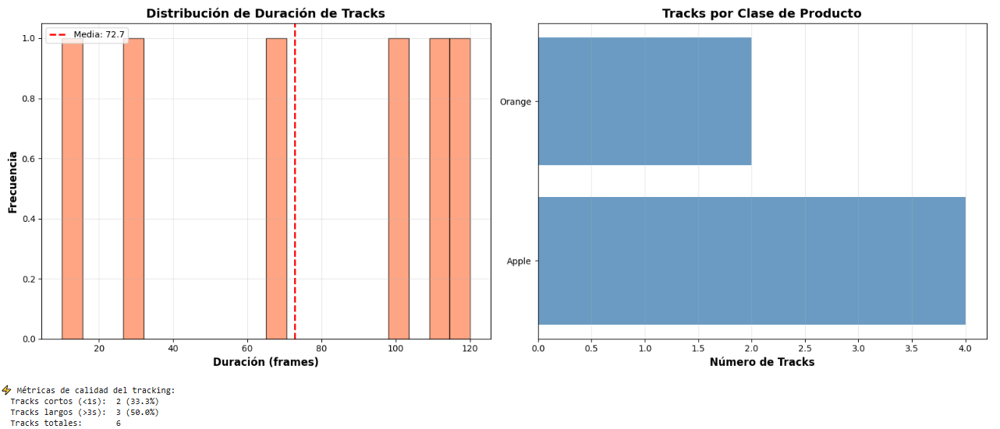

## **Reflexión**

En esta actividad pudimos hacer uso de modelos pre-entrenados como YOLOv8 en COCO, para luego aplicarle fine-tuning con el dataset de Kaggle de Fruit Detection Dataset para mejorar el rendimiento del mismo y finalmente usar Norfair para pasar de Object Detection en imágenes a Tracking en videos.

## **Referencias**

*Assignment UT3-11: YOLOv8 Fine-tuning & Tracking - Fundamentos del Aprendizaje Automático - Universidad Católica del Uruguay*. (n.d.). [https://juanfkurucz.com/ucu-ia/ut3/11-object-detection-assignment/](https://juanfkurucz.com/ucu-ia/ut3/11-object-detection-assignment/)

*YOLOV8: State-of-the-Art Computer Vision Model*. (n.d.-b). [https://yolov8.com/#what-is](https://yolov8.com/#what-is)

tryolabs. (n.d.). *GitHub - tryolabs/norfair: Lightweight Python library for adding real-time multi-object tracking to any detector.* GitHub. [https://github.com/tryolabs/norfair](https://github.com/tryolabs/norfair)

*Google Colab*. (n.d.-h). [https://colab.research.google.com/drive/1yvIdfVXsMbKiK5PTC95gRYGdSn6dGw2K?usp=sharing](https://colab.research.google.com/drive/1yvIdfVXsMbKiK5PTC95gRYGdSn6dGw2K?usp=sharing)