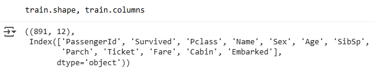
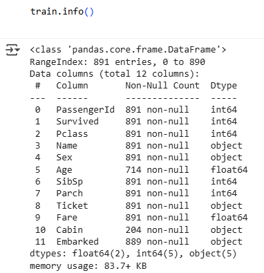
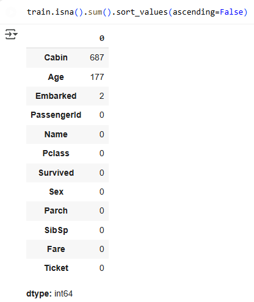
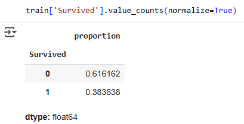
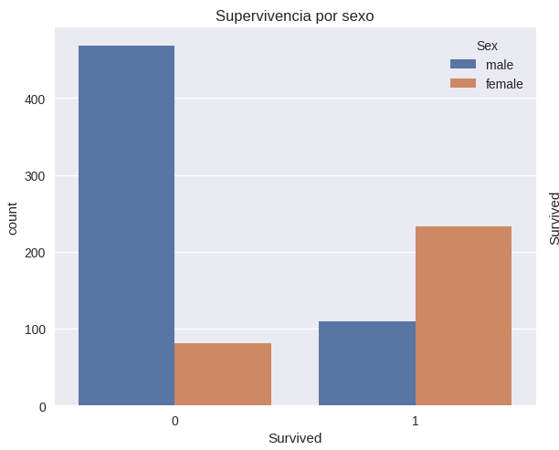
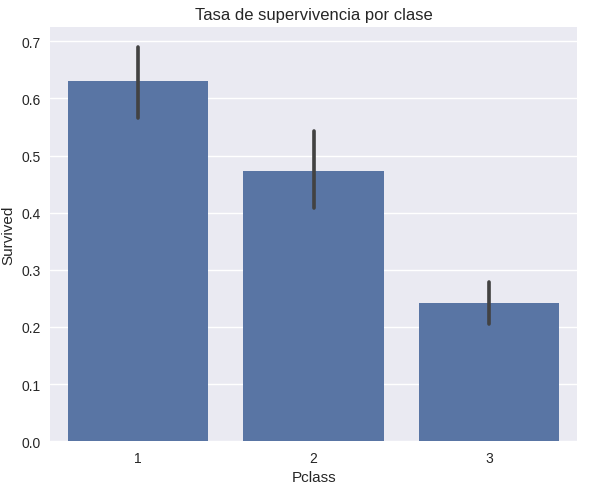
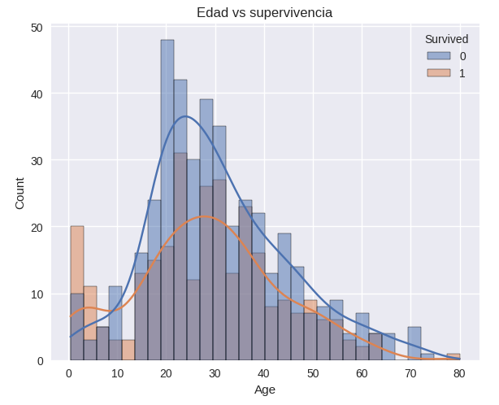
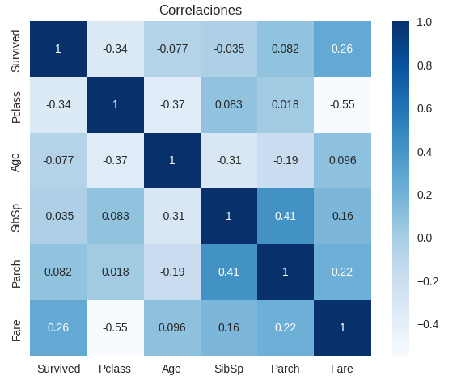
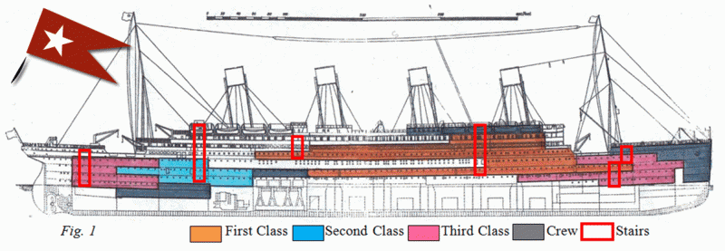

# UT1-TA1-Eda-Titanic

| Title | Date |
| --- | --- |
| UT1-TA1-Eda-Titanic | 18/09/25 |

# **UT1-TA1-Eda-Titanic**

## **Contexto**

Esta es la primera actividad del curso, en la cual usaremos el contexto del Titanic para construir un modelo predictivo que conteste la pregunta de “¿Qué tipos de personas eran las más probables de sobrevivir?” usando datos de los pasajeros (ej: nombre, edad, género, estatus socioeconómico y demás).

Como es la primera instancia de acercamiento a machine learning en el curso, estableceremos conocimientos básicos, convenciones y metodologías que vamos a usar en actividades más complejas más adelante. Además utilizaremos Google Colab para levantar nuestro proyecto, en conjunto de bibliotecas estándar como pandas, numpy, matplotlib y seaborn. 

## **Objetivos**

- Entender de qué se trata el dataset de Kaggle del Titanic.
- Entender cómo se separa el dataset.
- Cargar el dataset.
- Exponer visualmente los datos.

## **Actividades**

1. **Investigación del Dataset del Titanic (10 min)**
2. **Setup en Colab (5 min)**
3. **Cargar el dataset de Kaggle con su API (5-10 min)**
4. **Conocer el dataset (10 min)**
5. **EDA visual con seaborn/matplotlib (15 min)**

## **Desarrollo**

En esta actividad vamos a usar el dataset del Titanic de Kaggle, el cual tiene datos de los pasajeros del barco en el viaje que se hundió. El propósito de este dataset es poder armar un modelo de Machine Learning que sea capaz de, con los atributos de los pasajeros, poder hacer predicciones acerca de si una persona sobreviviría al accidente o no.

Viendo el dataset, nos encontramos con que el mismo está dividido en dos partes (no contamos el ejemplo de archivo de subida para la competencia): un training set (train.csv) y un test set (test.csv). Ambos contienen datos de los pasajeros, con atributos como clase en la que viajó el pasajero, su género, su edad, la cantidad de hermanos y parejas abordo, la cantidad de padres e hijos abordo y demás. 

Ambos sets son iguales en estructura, con la diferencia que el training set no tiene el resultado de la predicción (si el pasajero sobrevive o no). Esto es debido a que no tiene sentido que el modelo se entrene con el resultado de la predicción, ya que se da un caso de data contamination, donde se quiere predecir si un pasajero sobrevive o no, sabiendo el resultado de dicha predicción de antemano.

Con esto en mente, ya podemos armar el ambiente en el cual armamos, entrenamos y probamos el modelo predictivo. Siguiendo la guía y recomendaciones del profesor, armamos el ambiente en Google Colab, guardando los datos en Google Drive y cargando los datos del dataset con la API de Kaggle.

Una vez cargado el dataset, empezamos a indagar en distintos aspectos del mismo. Primero, usando el subset de entrenamiento, vemos que tiene 891 entradas (pasajeros) y 12 columnas (atributos o features, que tenemos 12 en vez de 11 ya que el subset viene con el atributo “survived”, que es el target u objetivo a predecir) (Evidencia 1).

También podemos ver que de las 12 columnas solo 2 tienen valores nulos o faltantes, siendo estas las columnas de edad y cabinas (la columna que describe de qué puerto embarcó el pasajero tiene solo 2 entradas faltantes, por lo cual, elijo no contarla) (Evidencia 2). Para finalizar nuestro análisis del dataset, vemos que un 61.61% de los pasajeros no sobrevivieron al accidente, mientras que el 38.38% restante si (Evidencia 3).

Con la comprensión del dataset, su estructura y sus datos, podemos ir adelante con la visualización de los mismos. Tomando el código provisto por el profesor, después de ejecutarlo, tenemos distintas visualizaciones de los datos (Evidencia 4): supervivencia al accidente por sexo, tasa de supervivencia por clase, edad contra supervivencia, y finalmente, una matriz de correlación entre los atributos que hacen referencia hacia si el pasajero sobrevivió o no, la clase en la que viajó el mismo, su edad, la cantidad de hermanos y parejas abordo y la cantidad de padres e hijos abordo.

## **Evidencias**

**Evidencia 1**

**Evidencia 2**

**Evidencia 3**

**Evidencia 4**

**Evidencia 5**

## **Reflexión**

Para contestar la pregunta original: “¿Qué tipos de personas eran las más probables de sobrevivir?”, apoyándose en la matriz de correlación, tenemos que el atributo que más se relaciona con la supervivencia del pasajero es la clase en la que viajó (inversamente proporcional, mientras menor el número de clase mayor será la probabilidad de sobrevivir), seguido del costo de su pasaje (proporcional, mientras más caro el boleto mayor probabilidades de sobrevivir).

Sin tener el contexto completo se podría creer que el modelo hizo overfitting, adquiriendo un patrón irrelevante y dándole mucho peso para hacer las predicciones. Sin embargo, viendo la distribución de las cabinas por clase de pasajero y las ubicaciones de las escaleras, vemos que los pasajeros en primera clase podían evacuar de manera más rápida que los de segunda y tercera clase. Además del acceso más rápido, podría ser que se les de preferencia a los pasajeros de “clase alta” sobre los demás. Es por todo esto, que tiene sentido la correlación encontrada.

También vemos que los niños (menores a 10 años) tienen mayor probabilidad a sobrevivir, en proporción al resto. Además, vemos que los hombres son 4 veces más probables a no sobrevivir que si hacerlo, mientras que las mujeres son más del doble más probables de sobrevivir que no. Una vez más, tiene sentido, sobre todo por el famoso dicho “mujeres y niños primero”.

## **Referencias**

*Práctica 1: EDA del Titanic en Google Colab - Fundamentos del Aprendizaje Automático - Universidad Católica del Uruguay*. (n.d.). https://juanfkurucz.com/ucu-ia/ut1/01-eda-titanic/

*Titanic - Machine Learning from Disaster*. (n.d.). Kaggle. [https://www.kaggle.com/competitions/titanic/overview](https://www.kaggle.com/competitions/titanic/overview)

 (2022) Copyright and Permissions ( ref: #656, published 10 March 2022, generated 30th August 2025 11:24:08 PM); URL : [https://www.encyclopedia-titanica.org/copyright-and-permissions.html](https://www.encyclopedia-titanica.org/copyright-and-permissions.html)

*Google Colab*. (n.d.). [https://colab.research.google.com/drive/1AvW6jTu89W-J8x5ZyFuUcTHhEjeekIQR?usp=sharing](https://colab.research.google.com/drive/1AvW6jTu89W-J8x5ZyFuUcTHhEjeekIQR?usp=sharing)
