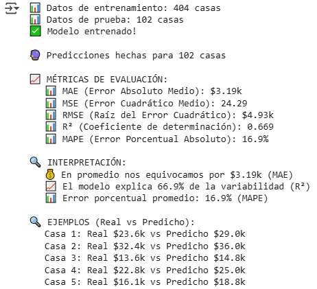
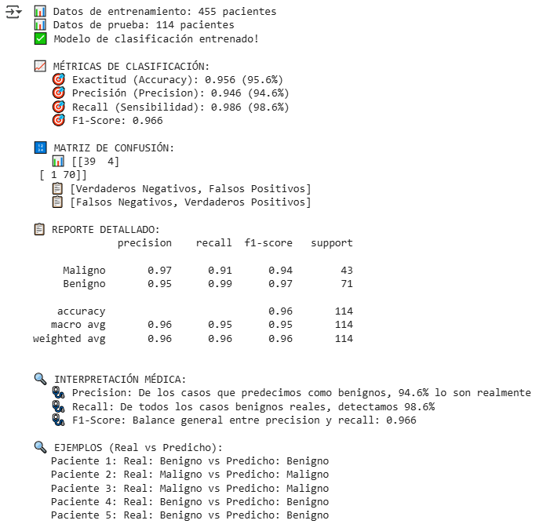

# UT1-TA3-Regresión-Lineal-Logística

| Title | Date |
| --- | --- |
| UT1-TA3-Regresión-Lineal-Logística | 21/09/25 |

# UT1-TA3-Regresión-Lineal-Logística

## **Contexto**

En esta actividad veremos aplicaciones prácticas de modelos de Machine Learning de regresión lineal. Usaremos Kaggle para obtener un dataset de precios y características de casas en Boston y Sklearn para obtener un dataset de cáncer de mama. Seguiremos usando la metodología CRISP-DM para analizar los datasets y entender cómo debemos manipular los datos para que el modelo armado pueda predecir lo que nosotros necesitemos.

En el primer caso lo que vamos a querer hacer es estimar el precio de las propiedades automáticamente para que una inmobiliaria pueda tomar mejores decisiones, automatizando valuaciones y optimizar inversiones inmobiliarias. Las predicciones serán hechas en las características del barrio.

En el segundo caso queremos hacer una asistencia automatizada para el diagnóstico de cáncer de mama, clasificando tumores como benignos o malignos basándose en características de las células. En el caso de producir un modelo que acierte en sus predicciones, se puede reducir mucho el tiempo de análisis y darle una segunda opinión a los médicos.

## **Objetivo**

- Cargar y explorar datos.
- Implementar regresión lineal paso a paso.
- Implementar regresión logística paso a paso.
- Interpretar resultados de forma simple.

## **Actividades**

- **Parte 1: Regresión Lineal - Predecir Precios de Casas (45 min)**
    - **Paso 1: Setup Inicial (10 min)**
    - **Paso 2: Cargar Dataset de Boston Housing (20 min)**
    - **Paso 3: Entrenar Regresión Lineal (15 min)**
- **Parte 2: Regresión Logística - Diagnóstico Médico (45 min)**
    - **Paso 4: Cargar Datos Médicos (10 min)**
    - **Paso 5: Entrenar Regresión Logística (15 min)**
    - **Paso 6: Preguntas de Reflexión (20 min)**
- **Parte 3: Actividad Final - Compara los Dos Modelos (15 min)**
    - **Paso 7: Comparación Simple (5 min)**
    - **Paso 8: Reflexión Final (10 min)**

## **Desarrollo**

Empezamos la actividad importando las herramientas que vamos a necesitar y los dataset con la información de los casos. En este caso vamos a usar Pandas, Numpy y Matplotlib como de costumbre, y para los modelos vamos a usar LinealRegression y LogisticRegression de Sklearn. Además, volvemos a usar train_test_split y classification_report, que hemos usado en actividades pasadas. También sumaremos métricas para evaluar ajustes a nuestros modelos como mean_absolute_error, mean_squared_error y r2_score, que nos permiten saber el error de nuestro modelo y qué tan bien está haciendo predicciones.

Luego podemos cargar los datos de las casas de Boston y ver su estructura y contenidos. Es un dataset con 506 casas y 14 atributos distintos, dentro de los cuales tenemos el índice de crimen, porcentaje del terreno residencial zonificado, antigüedad de la vivienda y demás. Nuestro objetivo es medv, que refiere al valor mediano de las viviendas en miles de dólares.

Para este caso vamos a usar la regresión lineal, el cual es un modelo que tiene forma de recta (Evidencia 1). La esencia de este modelo es que se tienen varios factores a ajustar: el sesgo (o bias) que es el factor independiente y los pesos (o weights) (Evidencia 2). Durante el entrenamiento, el modelo se irá ajustando a sí mismo para que la distancia entre él mismo y el dato real sea la mínima. Esta distancia es el error, mientras la distancia entre el modelo y el dato se reducen, lo hace también el error. Para las predicciones complejas, como es este caso, no hay un solo factor que influya en el precio de la venta de una casa, por lo tanto nuestro modelo tendrá múltiples atributos que manejar. Vale la pena aclarar que todo el ajuste interno de los pesos y sesgos es hecho automáticamente por el modelo, nosotros solo debemos instanciarlo y darle la información con la cual será entrenado y probado.

Con esto en mente ya podemos entrenar y probar nuestro modelo. Para medir qué tan bueno es usamos múltiples métricas, como el error absoluto medio (media aritmética), error cuadrado medio, raíz del error cuadrático, coeficiente de determinación y error porcentual absoluto. Las usamos todas ya que distintas métricas tienen ciertos comportamientos ante ciertas situaciones, por ejemplo, el error absoluto medio no es tan afectado si hay un valor disparado de lo usual o esperado (outlier) mientras que el error cuadrado medio si lo es. Según si nos importa penalizar o no a los outliers, le prestaremos más atención a uno que al otro.

Pasando al segundo caso del cáncer de mama empezamos por separar los atributos del target, del cual contamos los casos malignos y benignos. Obtenemos 569 casos en total, de los cuales 212 son malignos y 357 son benignos. En este caso vamos a usar el modelo regresión logística, la cual es usada para clasificar datos. Nosotros manejamos una clasificación binaria en este contexto, o el caso es maligno o es benigno, no hay más opciones. Este modelo toma los atributos que le damos y calcula un número entre 1 y 0, que después es pasado por una función sigmoide y según si es mayor, menor o igual a 0.5 cae en una categoría u otra.

A diferencia del caso anterior con la regresión lineal, no podemos calcular un error natural o entero, ya que acierta o no. Para medir el rendimiento de este modelo necesitamos usar otras métricas, como exactitud (accuracy_score), precisión (precision_score), recall y f1_score, como vimos en la actividad pasada. Además, podemos hacer uso de una matriz de confusión para ver los casos verdaderos positivos, verdaderos negativos, falsos positivos y falsos negativos.

## **Evidencias**

Evidencia 1

Evidencia 2

Evidencia 3

Evidencia 4

## **Reflexión**

En esta actividad usamos distintos modelos de Machine Learning para resolver problemas de naturalezas distintas: predicción numérica y predicción predicción clasificatoria.

En el primer caso vemos que las predicciones del modelo suelen equivocarse en un margen de $3.19k, con un error porcentual absoluto de 16.9%, explicando 66.9% de la variabilidad (Evidencia 3). Podemos concluir con que el modelo tiene un rendimiento satisfactorio.

En el segundo caso tenemos que el modelo predice con 95.6% de exactitud, 94.6% de precisión, una sensibilidad de 98.6% y un puntaje F1 de 96.6% (Evidencia 4). Esto quiere decir que el modelo es extremadamente bueno, o por lo menos eso parece ser con estos datos de entrenamiento y prueba. Quizá sea realmente muy bueno, pero vale la pena considerar que haya ocurrido un caso de overfitting. Para poner esto a prueba se deberían conseguir más datos para predecir y ver su rendimiento en estos datos nuevos, no vistos anteriormente. Una predicción errónea es especialmente costosa, ya que conlleva un tratamiento equivocado a una persona que le puede costar la vida.

En esta actividad aplicamos la metodología CRISP-DM para investigar dos datasets distintos, entender la información que representan y armar modelos de Machine Learning que sean capaces de hacer predicciones. Pudimos evaluar a dichos modelos y sacar conclusiones acerca de su rendimiento y calidad, generando valor para las distintas partes interesadas en los distintos contextos.

## **Referencias**

*Tarea 4: Regresión Lineal y Logística - Fill in the Blanks (INSTRUCTOR) - Fundamentos del Aprendizaje Automático - Universidad Católica del Uruguay*. (n.d.). [https://juanfkurucz.com/ucu-ia/ut1/04-regresion-lineal-logistica/](https://juanfkurucz.com/ucu-ia/ut1/04-regresion-lineal-logistica/)

*Boston housing dataset*. (2017, October 27). Kaggle. [https://www.kaggle.com/datasets/altavish/boston-housing-dataset/data](https://www.kaggle.com/datasets/altavish/boston-housing-dataset/data)

*UCI Machine Learning Repository*. (n.d.). [https://archive.ics.uci.edu/dataset/17/breast+cancer+wisconsin+diagnostic](https://archive.ics.uci.edu/dataset/17/breast+cancer+wisconsin+diagnostic)

*Google Colab*. (n.d.-b). [https://colab.research.google.com/drive/1X3GfMn-0yZyhcCDZi8jgUcsNiIfUydIB?usp=sharing](https://colab.research.google.com/drive/1X3GfMn-0yZyhcCDZi8jgUcsNiIfUydIB?usp=sharing)