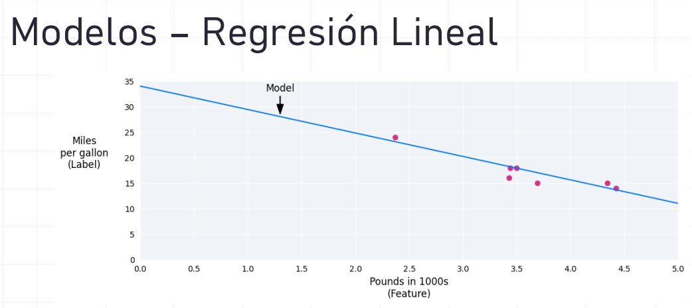
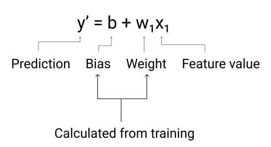
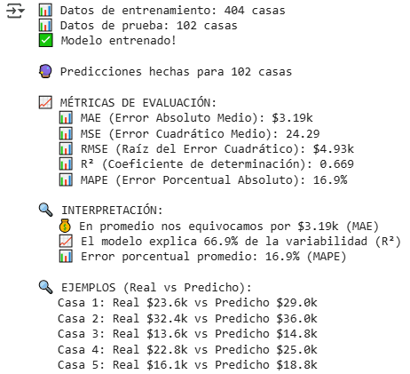
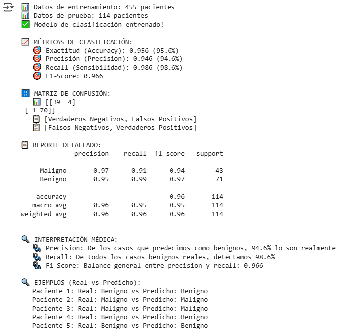

# UT1-TA4 Validación y Selección de Modelos

| Title | Date |
| --- | --- |
| UT1-TA4 Validación y Selección de Modelos | 21/09/25 |

# UT1-TA4 Validación y Selección de Modelos

## **Contexto**

En esta actividad vamos a usar el dataset de UCI sobre datos estudiantiles. Este dataset busca dar información para el armado de modelos de Machine Learning que ayuden a identificar estudiantes propensos a abandonar la carrera, para poder apoyarlos en etapas tempranas y lograr que se reciban. En consecuencia, modelos de predicción exitosos pueden ayudar a reducir las tasas de abandono y mejorar la retención estudiantil.

Usaremos distintos tipos de modelos de clasificación, siendo estos LogisticRegression, RidgeClassifier y RandomForestClassifier con el fin de comparar el rendimiento de cada uno a la hora de predecir si un estudiante es un abandonador o no.

Además usaremos validación cruzada para sacarle todo el provecho a los datos, en conjunto a pipelines para facilitar el armado, entrenado y probado de los modelos. 

## **Objetivo**

- Aprender a prevenir data leakage usando pipelines.
- Implementar validación cruzada (cross-validation) robusta.
- Comparar múltiples modelos de forma sistemática.
- Interpretar métricas de estabilidad y selección de modelos.

## **Actividades**

- **Parte 0: Investigación del dataset (30 min)**
    - **Paso 1: Setup Inicial (10 min)**
    - **Paso 2: Cargar y Explorar Datos de Estudiantes (20 min)**
- **Parte 1: Cross-Validation - Validación Robusta (20 min)**
    - **Paso 3: Preparar datos para validación (10 min)**
    - **Paso 4: Implementar Validación Cruzada (10 min)**
- **Parte 2: Comparación de Modelos - ¡El Torneo! (15 min)**
    - **Paso 5: Competencia de Múltiples Modelos (15 min)**
- **Parte 3: Optimización de Hiperparámetros (10 min)**
    - **Paso 6: GridSearchCV vs RandomizedSearchCV (15 min)**
- **Parte 4: Explicabilidad del Modelo (30 min)**
    - **Paso 7: ¿Por qué el modelo toma esas decisiones? (30 min)**

## **Desarrollo**

Empezamos la actividad como todas las anteriores, importando las librerías y funciones que necesitaremos para completar nuestras tareas. En este caso aparecen un par de modelos nuevos: RidgeClassifier y RandomForestClassifier. RidgeClassifier se parece mucho a Logistic Regression, con la diferencia que se base en regresión lineal con regularización Ridge (L2). Lo que hace L2 es que a la hora de entrenar el modelo “pone un freno” para que los coeficientes no se hagan demasiado grandes, evitando hacer overfitting.

RandomForestClassifier sale de la categoría de clasificadores lineales y usa árboles de decisión. Estos árboles dividen los datos en categorías, basándose en bifurcaciones binarias, o comparando el dato ante una condición en la cual solo hay dos posibilidades. Como ejemplo puede ser que se esté evaluando a un auto para saber si es considerado deportivo, y una de estas consideraciones que toma el árbol es si el auto tiene más de 2 puertas. Si tiene más de 2 puertas se le hacen ciertas consideraciones, mientras que si tiene 2 puertas o menos, se le hacen otras. RandomForestClassifier toma muchos de estos árboles y cada uno da su voto y gana la mayoría.

Luego en las nuevas herramientas que vamos a usar tenemos a cross_val_score, que sirve para aplicar validación cruzada automática, StratifiedKFold, que asegura que en cada fold se mantenga la misma proporción de clases que en el dataset original, y StandardScaler, que sirve para estandarizar los datos de entrenamiento de un modelo (previo a su entrenamiento). 

Usar cross_val_score nos sirve para aprovechar más los datos que tenemos, sobre todo cuando no tenemos un volumen grande, en los cuales pueden aparecer patrones que son útiles para predecir. Seccionando el dataset en partes iguales y haciendo varios entrenamientos, cambiando las secciones que se eligen para entrenar y cuales se eligen para probar, obtenemos resultados más robustos. StratifiedKFold va de la mano, ya que no queremos que cuando seccionemos los datos nos quede una parte con patrones falsos, que pueden inducir overfitting.

Usar StandardScaler nos sirve para darle datos al modelo que le sean más familiares o naturales, lo cual suele rendir resultados mejores y más precisos.

En este dataset tenemos a 4424 estudiantes con 36 características que los describen. Entre las características hay tenemos su estado civil, curso, si va de día o de noche a clase, nacionalidad, calificaciones de los padres y demás. Lo que queremos predecir es si el estudiante abandonó la carrera o no. Tenemos como dato de color que el promedio de edad del dataset es de 23.3 años, que el estudiante más joven tiene 17 años y que el más viejo tiene 70 años. 

Empezamos por crear un pipeline con StandardScaler como escalador y RidgeClassifier como clasificador, con un límite de iteraciones de 1000 y declaramos random_state a un número cualquiera para reproducción. Con este pipeline vamos a comparar la estabilidad brindada por KFold y StratifiedKFold.

Para KFold declaramos 5 splits, shuffle y random_state a un número cualquiera para reproducción. Para StratifiedKFold hacemos lo mismo. Luego instanciamos cross_val_score con nuestro pipeline, atributos, target y tipo de fold (KFold o StratifiedKFold). Además establecemos scoring por puntería. En este caso obtenemos que StratifiedKFold es más estable, por lo cual es el que vamos a usar para comparar los modelos (Evidencia 1).

Para LogisticRegression setteamos max_iter en 1000 y random_state en 42, para RidgeClassifier setteamos alpha en 1.0 y random_state en 42 y finalmente para RandomForestClassifier setteamos el número de estimadores en 10 y random_state en 42. Con esto armamos nuestras pipelines, declarando StandardScaler como escalador para RidgeClassifier y LogisticRegression. RandomForestClassifier no necesita escalador. Usamos la configuración de StratifiedKFold mencionada más arriba.

Cuando enfrentamos los modelos obtenemos que RandomForestClassifier es el ganador, ya que en promedio es más certero que los demás e incluso su peor caso es mejor que el mejor del RidgeClassifier.

Ya sabemos que RandomForestClassifier es nuestro mejor modelo para este caso, ahora nos queda optimizar los parámetros para conseguir mejores predicciones. Para hacer esto creamos listas de distintos valores para los parámetros n_estimators, max_depth y min_samples_split, lo cual nos permitirá, con ayuda de GridSearchCV y RandomizedSearchCV, encontrar los valores más óptimos. Adicionalmente a RandomizedSearchCV le pondremos un límite de 20 iteraciones, para reducir tiempos de ejecución.

Después de ejecutar el código tenemos que GridSearchCV probó 36 combinaciones distintas, encontrando que los valores óptimos para max_depth, min_samples_split y n_estimators son None, 5 y 100 respectivamente. Por el otro lado, RandomizedSearchCV probó 20 combinaciones distintas, encontrando 30, 5 y 100 respectivamente. Ambos métodos tienen un score de 0.7783. En este caso podemos darle la preferencia a RandomizedSearchCV por conseguir el mismo puntaje con menos combinaciones probadas.

Finalmente sabemos qué modelo es el mejor para este contexto y con qué parámetros, por lo tanto, vamos a ver cuáles son las características que más influyen en las predicciones del RandomForestClassifier. Esto nos va a mostrar lo que más influye en que un estudiante abandone los estudios.

## **Evidencias**

Evidencia 1

Evidencia 2

Evidencia 3

Evidencia 4

Evidencia 5

## **Reflexión**

Después de mucha puesta a prueba de distintos modelos, parámetros, métodos de segmentación de datos y formas de armar los modelos, tenemos un modelo que predice con casi 80% de puntería, lo cual es satisfactorio. 

Viendo el funcionamiento interno del RandomForestClassifier vemos que los factores más influenciales en determinar que un estudiante dejará los estudios o no son la cantidad de materias aprobadas en el segundo semestre, las notas obtenidas en dicho semestre, la cantidad de materias aprobadas en el primer semestre, las notas obtenidas en dicho semestre y los pagos de tutoría (académicos) que han hecho hasta el momento, entre otros (Evidencia 4).

Separando los factores por categorías vemos que los factores académicos son los más influyentes en si el estudiante abandona sus estudios o no, seguido de los factores económicos y finalmente los factores demográficos (Evidencia 5).

En esta actividad pudimos utilizar la metodología CRISP-DM para entender nuestro dataset y tener una instancia de prueba y error, comparando distintos modelos, configuraciones y métodos para encontrar la combinación que más se acople a nuestra situación y nos de los mejores resultados posibles.

## **Referencias**

*Tarea 5: Validación y Selección de Modelos - Fill in the Blanks - Fundamentos del Aprendizaje Automático - Universidad Católica del Uruguay*. (n.d.). [https://juanfkurucz.com/ucu-ia/ut1/05-validacion-seleccion-modelos/](https://juanfkurucz.com/ucu-ia/ut1/05-validacion-seleccion-modelos/)

*UCI Machine Learning Repository*. (n.d.-b). [https://archive.ics.uci.edu/dataset/697/predict+students+dropout+and+academic+success](https://archive.ics.uci.edu/dataset/697/predict+students+dropout+and+academic+success)

*Google Colab*. (n.d.-c). [https://colab.research.google.com/drive/1j3bcJ-rMZIiIeS7sCfMhY9wjSdEbB4N6?usp=sharing](https://colab.research.google.com/drive/1j3bcJ-rMZIiIeS7sCfMhY9wjSdEbB4N6?usp=sharing)