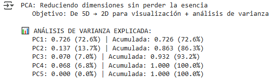
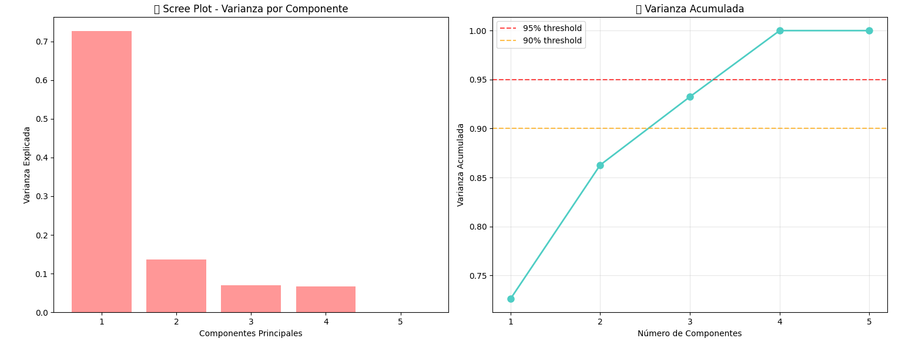
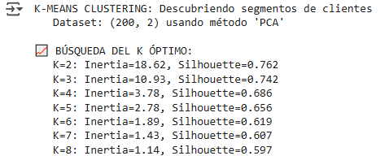

# UT1-TA6-clustering-pca

| Title | Date |
| --- | --- |
| UT1-TA6-clustering-pca | 21/09/25 |

# UT1-TA6-clustering-pca

## **Contexto**

En esta actividad final de la primera unidad del curso analizaremos el dataset de Kaggle de clientes de un centro comercial. La idea es que con este dataset podamos tomar los datos de los clientes y encontrar patrones que nos permitan agruparlos para generar una estrategia de marketing más eficiente y detallada a los grupos encontrados. Usaremos Clustering y PCA para encontrar dichos grupos.

## **Objetivo**

- Aplicar clustering y PCA para descubrir patrones en datos de comportamiento de compra.
- Identificar 3-5 segmentos de clientes distintos usando K-Means.
- Aplicar técnicas de normalización (MinMax, Standard, Robust).
- Usar PCA para reducción de dimensionalidad y visualización.
- Comparar PCA con métodos de selección de features.
- Interpretar resultados desde perspectiva de negocio.

## **Actividades**

- **FASE 1: BUSINESS UNDERSTANDING (20 min)**
    - **Paso 1: Entender contexto del análisis (20 min)**
- **FASE 2: DATA UNDERSTANDING (190 min)**
    - **Paso 2.1: Setup Inicial (10 min)**
    - **Paso 2.2: Carga del Dataset (10 min)**
    - **Paso 2.3: Inspección Inicial del Dataset (15 min)**
    - **Paso 2.4: Análisis de Tipos de Datos (10 min)**
    - **Paso 2.5: Análisis de Distribución por Género (10 min)**
    - **Paso 2.6: Estadísticas de Variables Clave (10 min)**
    - **Paso 2.7: Detección de Outliers (10 min)**
    - **Paso 2.8: Visualizaciones - Distribuciones (5 min)**
    - **Paso 2.9: Visualizaciones - Relaciones (5 min)**
    - **Paso 2.10: Matriz de Correlación (10 min)**
    - **Paso 2.11: Análisis Comparativo por Género (10 min)**
    - **Paso 2.12: Síntesis de Insights (20 min)**
    - **Paso 2.13: Identificación de Features para Clustering (15 min)**
    - **Paso 2.14: Codificación de Variables Categóricas con OneHotEncoder (10 min)**
    - **Paso 2.15: Preparación del Dataset Final (15 min)**
    - **Paso 2.16: Verificación de Calidad de Datos (15 min)**
    - **Paso 2.17: Análisis de Escalas (Pre-Normalización) (10 min)**
- **FASE 3: DATA PREPARATION**
    - **Paso 3.1: Setup para Normalización (30 min)**
        - **Paso 3.1.2: Aplicar los 3 Scalers (5 min)**
        - **Paso 3.1.3: Comparación Visual - Boxplots (5 min)**
        - **Paso 3.1.4: Comparación de Distribuciones (5 min)**
        - **Paso 3.1.5: Análisis Estadístico Post-Scaling (5 min)**
        - **Paso 3.1.6: Test de Impacto en Clustering (5 min)**
        - **Paso 3.1.7: Decisión Final de Scaler (5 min)**
    - **Paso 3.2: PCA - Reducción de Dimensionalidad (20 min)**
    - **Paso 3.3: Feature Selection - Alternativas a PCA (60 min)**
        - **Paso 3.3.1: Imports y Setup Feature Selection (5 min)**
        - **Paso 2: Setup y Función de Evaluación (5 min)**
        - **Paso 3: Baseline - Todas las Features (5 min)**
        - **Paso 4: Forward Selection (5 min)**
        - **Paso 5: Backward Elimination (5 min)**
        - **Paso 6: Comparación Final (5 min)**
        - **Paso 7: Visualización Comparativa (5 min)**
        - **Paso 8: Análisis y Decisión Final (15 min)**
        - **Paso 9: Decisión para el Pipeline Final (10 min)**
- **FASE 4: MODELING (30 min)**
    - **Paso 4.1: K-Means Clustering - Encontrando los Grupos (30 min)**
- **FASE 5: EVALUATION (80 min)**
    - **Paso 5.1: Análisis de Clusters y Perfiles (25 min)**
    - **Paso 5.2: Análisis Silhouette Detallado (15 min)**
    - **Paso 5.3: Identificación de Outliers (10 min)**
    - **Paso 5.4: Análisis de Perfiles de Cliente (30 min)**

## **Desarrollo**

En esta actividad vamos a usar el dataset de Kaggle sobre clientes de un centro comercial. Este dataset tiene 200 clientes con 5 atributos distintos: ID de cliente, género, edad, ingreso anual (en miles de dólares, o k$) y puntuación de gasto (spending score). Es un dataset relativamente pequeño, sin datos faltantes y los datos no requieren procesamiento alguno para poder ser usados. El dataset esta dividido en 56% mujeres y 44% hombres, donde la mediana de edad es 38.85, 60.56k$ y tienen un spending score de 50.20. Este spending score es asignado por el centro comercial según el comportamiento y naturaleza gastadora del cliente, por lo tanto, tiene sentido que la mediana sea cercana a 50 en una escala de 0-100.

Observando el dataset vemos que no hay outliers por edad (tenemos como parámetros teóricos -1.6 y 79.4, pero sabemos que no hay persona que tenga “edad negativa”, así que tiene sentido que no haya ningún cliente no nacido; y tampoco hay mayores a 79 años), hay 2 outliers por ingreso anual (parámetros teóricos -13.2 y 132.8, esta vez podría llegar a considerarse si la persona tiene deudas mayores a su ingreso anual, dándole un valor negativo, sin embargo, tomaremos los valores entre $0 y $132.800.000) y ningún outlier en el spending score (-22.6 y 130.4, esta vez no tiene sentido que haya ningún cliente que se salga de la escala armada por el centro comercial, ya que tendrían en cuenta dicho cliente) (quizá se elija tomarlos como outliers, y manejarlos de otra manera, pero en nuestro contexto y con la información que tenemos no lo tomaremos como un valor lógico) (Evidencia [1](#evidencia-1)). Graficando los datos de los clientes concluimos con nuestras hipótesis de valores que no son lógicos (Evidencia [2](#evidencia-2)).

Luego podemos graficar las relaciones que hay entre estos 3 atributos: edad con ingreso, ingreso con spending score y edad con spending score (Evidencia [3](#evidencia-3)). 

La primera gráfica es en la que hay valores más distribuidos, haciendo que sea más difícil ver un patrón claro. 

Por el otro lado, vemos como en la segunda gráfica hay 5 claros cuadrantes en los que caen los clientes, lo cual nos deja sacar hipótesis como “las personas que ganan menos o gastan mucho o gastan poco, sin punto medio” o “las personas que ganan más o gastan mucho o gastan poco, sin punto medio”. Pero también podemos ver que las personas que ganan entre $40k y **~**$70k anualmente tienen un spending score de entre 40 y 60. Esto puede ser un indicador claro que a la hora de hacer la métrica para el puntaje se tomó a esta gente como “regla medidora” o algún caso del estilo. 

Viendo la última gráfica podemos llegar a identificar que hay una relación inversa entre el spending score y la edad del cliente, pero necesitamos ver más datos para concluir que esto es cierto efectivamente.

Poniendo estas características en una matriz de confusión obtenemos que el factor más fuertemente relacionado con el spending score es el ingreso anual del cliente (Evidencia [4](#evidencia-4)). Parece tener sentido, ya que las personas con mayor ingreso suelen ser las que tienen mayor poder adquisitivo, y por propiedad transitiva, tener mejor spending score.

Luego teniendo en cuenta el género de los clientes vemos que los hombres y las mujeres tienen prácticamente la misma edad de mediana, ingreso anual y spending score, pero las mujeres terminan siendo las que tienen spending scores más altos (aunque sólo por 3 puntos) (Evidencia [5](#evidencia-5)).

Vamos a dejar de lado el atributo CustomerID, ya que no nos aporta nada (es un patrón serial arbitrario, solo añade ruido a los datos) y usamos OneHotEncoder para crear dos atributos nuevos Genre_Female y Genre_Male. OneHotEncoder toma los valores atributos categóricos y crea columnas nuevas con los valores posibles, de modo que si una persona es Female, tendrá Genre_Female 1 y Genre_Male 0. Nos sirve para que el modelo pueda interpretar dichos atributos.

Con esto creamos un dataset final, dejando atrás CustomerID y Genre y agregando Genre_Female y Genre_Male. 

Nos queda que la media de edad es de 38.9, de ingreso es de $60.6k, de spending score es de 50.2, de mujeres es de 60% y de hombres es de 40%. El problema ahora se nos da que, con que excepción de Genre_Female y Genre_Male que comparten un rango de 1.0, todos tienen rangos distintos: age tiene un rango de 52.0, annual income tiene un rango de 122.0 y spending score tiene un rango de 98.0. Para normalizar estos datos se nos complica, ya que no se puede medir todo “con la misma regla”.

Usaremos MinMaxScaler para restringir todo a un rango entre 0 y 1, StandardScaler para estandarizar los datos (media de 0 y desviación estándar de 1) y RobustScaler para tener mediana y rangos intercuartílicos, siendo robusto a outliers (Evidencia [6](#evidencia-6)). Vemos que efectivamente, MinMaxScaler restringe los valores a un rango entre 0 y 1, mientras que StandardScaler los “alinea” más, permitiendo mejores comparaciones y relacionamiento entre atributos, y finalmente RobustScaler establece las medianas en 0.

Si miramos el ingreso anual podemos ver cómo la forma de la distribución no cambia, independientemente del método de escalado, pero los valores de los datos si (Evidencia [7](#evidencia-7)). Para saber qué método de escalado nos sirve es necesario hacer una evaluación que no sea “a ojo”, para esto sirve sillhouette_score. Esta métrica nos sirve para evaluar la calidad de un clustering, midiendo cada dato del dataset y dándole un valor entre -1 y 1. Si un dato recibe un puntaje cercano a 1 significa que este está en el grupo adecuado y lejos de los otros grupos. Si el puntaje es cercano a 0 significa que está en la frontera entre dos clusters, y si es cercano a -1 significa que está mal asignado y que pertenece a otro cluster. 

Aplicando KMeans con K=4 (para 4 grupos) y midiendo cada método de escalado obtenemos que el mejor método para este dataset es MinMaxScaler (Evidencia [8](#evidencia-8)). MinMaxScaler normaliza todos los datos dentro de un mismo rango, lo cual mejora la separación de clusters. Con el método de escalado seleccionado, podemos pasar a utilizar PCA para reducir la dimensionalidad de los datos de 5D a 2D para reducir complejidad y visualizar los datos (Evidencia [9](#evidencia-9)).

Luego queremos comparar Forward/Backward selection contra PCA. Usando Forward y Backward tenemos que el silhouette score es de 0.573, por igual. Comparando con PCA 2D, que tiene un score de 0.686, concluimos con que es nuestra mejor opción (Evidencia [10](#evidencia-10)). Tenemos que tanto Forward, como Backward, como PCA 2D son métodos aceptables, que superan el threshold del 0.5, pero PCA 2D casi llega al threshold de 0.75, por lo tanto, es un método competitivo, gracias a la reducción de dimensionalidad.

Luego usando KMeans queremos encontrar el K óptimo, utilizando el Elbow Method para ver la cómo cambia la pendiente de la recta según aumenta K (queremos ver el punto de quiebre o “codo” en el cual la curva pasa de caída empinada a caída suave) (Evidencia [11](#evidencia-11)). Usando ambos métodos (elbow y silhouette) obtenemos K de 6 y 2 respectivamente, por lo tanto, usamos 4 como punto medio. Esto significa que cuando busquemos clasificar nuestros clientes obtendremos 4 grupos distinguidos.

Cuando realizamos esto vemos que efectivamente es el caso, en el cual tenemos 4 grupos agrupados por perfil demográfico (edad y género) y perfil económico (ingreso anual y spending score)(Evidencia [12](#evidencia-12)). Estos clusters tienen en promedio un silhouette score de 0.69, lo cual es un poco por debajo de índice de “muy bueno”, pero aún así es bueno y nos vale la pena usarlo. Podemos chequear de igual manera si tenemos clusters con outliers, o personas que son agrupadas en un grupo a pesar de no pertenecer a él. Haciendo esto vemos que efectivamente todos los clientes están en su grupo demográfico-económico correcto (Evidencia [13](#evidencia-13)).

## **Evidencias**

### Evidencia 1

### Evidencia 2

### Evidencia 3

### Evidencia 4

### Evidencia 5

### Evidencia 6

### Evidencia 7

### Evidencia 8

### Evidencia 9

### Evidencia 10

### Evidencia 11

### Evidencia 12

### Evidencia 13

### Evidencia 14

## **Reflexión**

En esta actividad tuvimos la propuesta de encontrar patrones y agrupar clientes de un centro comercial, con atributos como su género, edad, ingreso anual y spending score y conseguimos hacerlo en 4 distintos (Evidencia [14](#evidencia-14)): jóvenes compradoras impulsivas, hombres mayores reservados, mujeres mayores moderadas y jóvenes compradores impulsivos. Estos agrupamientos son hechos por factores demográficos (edad y género) y factores financieros (ingreso anual y spending score).

A lo largo de esta actividad nos enfrentamos con muchos desafíos, desde entender gráficas sin patrones aparentes, hasta comparar distintas estrategias de estandarización y reducción de dimensionalidad para optimizar agrupamientos y facilitar interpretación visual de los patrones que se dieron. 
Finalmente, aplicamos métricas de evaluación y diferentes enfoques para validar los resultados, demostrando el potencial de los modelos de aprendizaje no supervisado (clustering) en la segmentación de clientes y su valor como herramienta de apoyo a la toma de decisiones.

## **Referencias**

*Tarea 6: Clustering y PCA - Mall Customer Segmentation - Fundamentos del Aprendizaje Automático - Universidad Católica del Uruguay*. (n.d.). [https://juanfkurucz.com/ucu-ia/ut1/06-clustering-pca/#paso-2-setup-y-funcion-de-evaluacion](https://juanfkurucz.com/ucu-ia/ut1/06-clustering-pca/#paso-2-setup-y-funcion-de-evaluacion)

*Mall Customer Segmentation data*. (2018, August 11). Kaggle. [https://www.kaggle.com/datasets/vjchoudhary7/customer-segmentation-tutorial-in-python/data](https://www.kaggle.com/datasets/vjchoudhary7/customer-segmentation-tutorial-in-python/data)

*Google Colab*. (n.d.-d). [https://colab.research.google.com/drive/1RzdwGlUI7XNcK4TFTgH7vdYsQJ75sBJM?usp=sharing](https://colab.research.google.com/drive/1RzdwGlUI7XNcK4TFTgH7vdYsQJ75sBJM?usp=sharing)