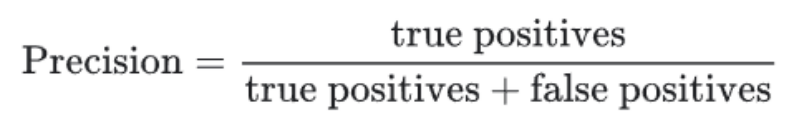
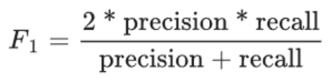
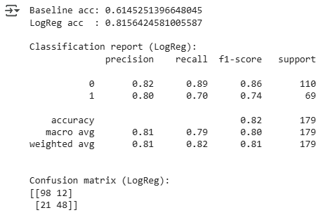

# UT1-TA2-Feature-Modelo-Base

| Title | Date |
| --- | --- |
| UT1-TA2-Feature-Modelo-Base | 20/09/25 |

# UT1-TA2-Feature-Modelo-Base

## **Contexto**

En esta actividad queremos tomar lo hecho en la actividad pasada (EDA Titanic) para realizar feature engineering y luego (con nuestro dataset modificado) realizar una comparación entre una predicción de un modelo base (DummyClassifier) y un modelo de regresión lógica (LogisticRegression).

A modo de refrescar la mente del lector, el dataset que estaremos usando es el de Kaggle del Titanic, el cual tiene información de pasajeros abordo del barco en el día del accidente. Kaggle propone una competencia, en la cual el propósito es armar, entrenar y probar un modelo de Machine Learning que sea capaz de predecir si un pasajero sobreviviría al accidente o no. 

En la actividad pasada vimos como distintos factores afectan más a la supervivencia de un pasajero, siendo la clase en la que viajan, el costo de su pasaje, el género del pasajero y si tienen familiares (hermanos, pareja, padres, hijos) abordo forman parte de los factores más influenciales. Tomaremos los atributos que nos da el dataset, para formar nuevos que nos permitan mejorar la calidad de nuestro modelo y (idealmente) mejorando su puntería en las predicciones.

## **Objetivos**

- Entender qué son LogisticRegression y DummyClassifier.
- Usar y comprender train_test_split.
- Crear atributos nuevos.
- Crear un modelo complejo que supere a nuestro modelo básico (baseline).
- Medir la calidad del modelo.

## **Actividades**

1. **Investigación de Scikit-learn (10 min)**
2. **Preprocesamiento y features (15 min)**
3. **Modelo base y baseline (20 min)**

## **Desarrollo**

Scikit-learn es una librería de Python para Machine Learning, la cual tiene muchas herramientas que nos van a ser útiles durante el curso. La usamos ya que no tenemos por qué construir nuestros propios modelos desde cero, declarando los algoritmos y funcionamientos internos de los mismos. Lo que nostros necesitamos (para estas actividades) es simplemente instanciar una función, establecer sus parámetros y finalmente usar dichas herramientas.

La primera que usaremos es LogisticRegression, la cual es un clasificador (especialmente útil para clasificaciones binarias, por ejemplo: llueve o no llueve en un día en particular, el paciente está enfermo o no, etc.). Tenemos muchos parámetros que nos son útiles a la hora de crear nuestro modelo, como puede ser penalty para declarar el tipo de penalización, max_iter para poner un punto de frenado, multi_class en caso de que se quiera saber si un dato cae en una clase en particular o en el resto, y finalmente tenemos solver que nos permite declarar el algoritmo numérico para optimizar el modelo. En caso de clasificaciones binarias usaremos liblinear.

DummyClassifier es la otra herramienta que usaremos, que nos permite armar un modelo “torpe” o “tonto” que ignorará las características y solo observará el objetivo durante el ajustado (o fit) del mismo. Básicamente, es un modelo que hace predicciones malas basándose en el objetivo, y nos es útil para establecer un baseline, ya que si nuestro modelo (que será en comparación al DummyClassifier más complejo) no mejora sus predicciones, estamos haciendo algo mal. Una vez más tenemos parámetros que nos son útiles para determinar el comportamiento del modelo, principalmente el llamado strategy, que nos permite determinar qué va a predecir el modelo de antemano. En nuestro caso vamos a usar most_frequent para que haga sus predicciones con el valor objetivo que más se repite en el dataset.

Luego tenemos train_test_split, que es una función que nos permite separar todo el dataset en varias partes que nos son útiles para entrenar y probar nuestros modelos. Con esta herramienta, podemos tomar el dataset entero (con sus features y target) y separarlo en datos de entrenamiento y prueba. A modo de tener predicciones consistentes (reproducibles), declaramos el valor de random_state a un número cualquiera y usamos stratify para garantizar que la proporción de clases en el subset de entrenamiento y prueba sea parecida.

Finalmente tenemos la función classification_report que nos permite medir la calidad de nuestro modelo con varias métricas. Precision o valor predictivo refiere al porcentaje de las predicciones positivas correctas (Evidencia [1](#evidencia-1)), recall refiere al porcentaje de las instancias positivas que identificó efectivamente (Evidencia [2](#evidencia-2)), F1-score que es como un punto medio entre precision y recall (Evidencia [3](#evidencia-3)) y support que refiere al número de muestras reales de cada clase en el dataset (que tantos datos pertenecen a esa clase).

Con esto en mente podemos empezar a preparar los datos para entrenar los modelos, comenzando por tratar con los valores faltantes o nulos. En la actividad pasada vimos como habían atributos con valores faltantes, los cuales son cabina (que no nos interesa, ya que no hay ninguna cabina que tenga una ventaja por el resto de las demás, y podemos categorizar las cabinas según su ubicación con la clase en la que viaja el pasajero) y edad.

Para rellenar estos datos usamos imputación. En el caso de la edad de los pasajeros tomamos la mediana de los pasajeros de la misma clase y del mismo género, para que la distribución de los datos no se vea distorsionada, por agregar valores en las colas. Si usamos la mediana de la distribución, el comportamiento de la misma suele no cambiar, esto nos es útil para agregar datos de una característica que no sigue un orden “serial”. Del mismo modo rellenamos el costo de los boletos con la mediana y los puertos de embarque con el valor más repetido.

Luego comenzamos con el feature engineering, creando un atributo FamilySize y sumándole el atributo SibSp (que refiere a siblings y spouses, o hermanos y parejas) y el atributo Parch (que refiere a Parent-children, o padres-hijos). Además le sumamos 1 al valor, para contar al pasajero mismo. Con FamilySize podemos crear un nuevo atributo IsAlone, que chequea si FamilySize es igual a 1 o no. Esto nos da, esencialmente, un booleano que nos dice si el pasajero está solo en el barco o no.

Después queremos tomar los títulos de las personas (Mr, Mrs, Dr, etc.) ya que un doctor puede tener preferencia sobre una persona que no lo es, por ejemplo. Para hacer esto usamos un regex y extraemos dichos títulos.

Con todos estos atributos más relevantes podemos armar nuestros modelos. Los atributos finales son los siguientes:

- Pclass
- Sex
- Age
- Fare
- Embarked
- FamilySize
- IsAlone
- Title
- SibSp
- Parch
- Survived (target, no se toma para predecir)

Omitimos atributos como nombre o número de cabina, ya que no son relevantes a la probabilidad de sobrevivir del pasajero, e incluirlos en el modelo simplemente agrega ruido en los datos.

Finalmente con todos los atributos necesarios podemos armar nuestros modelos, manteniendo una proporción 80:20 para entrenamiento y pruebas, respectivamente. Con nuestro DummyClassifier elegimos usar most_frequent como estrategia de predicción y con LogisticRegression lo frenamos con 1000 iteraciones, estrategia liblinear para predicciones booleanas (sobrevive o no). En ambos modelos declaramos random_state a un valor fijo para reproducción.

## **Evidencias**

### Evidencia 1

### Evidencia 2

### Evidencia 3

### Evidencia 4

## **Reflexión**

Gracias al feature engineering que hicimos, junto con las mediciones de calidad y comparación a un baseline, podemos ver que nuestro modelo puede predecir efectivamente (con un margen de error razonable) si un pasajero sobreviviría al accidente o no (Evidencia [4](#evidencia-4)). Vemos que la puntería de las predicciones del modelo mejora en comparación con su baseline. Además vemos que identifica correctamente un 80% de las veces el resultado correcto (si efectivamente sobreviviría o no) y que su f1-score es de 80% también. 

Para esta actividad lo tomaremos como un rendimiento satisfactorio, ya que querer mejorarlo puede significar demasiado trabajo para poca mejora, o correr el peligro de caer en patrones de overfitting, dando la ilusión de una mejoría cuando no la hay.

En esta actividad pudimos tomar el dataset del Titanic de Kaggle, modificarlo según nos pareció adecuado, establecer un baseline y entrenar un modelo, midiendo su performance.

## **Referencias**

*Práctica 2: Feature Engineering simple + Modelo base - Fundamentos del Aprendizaje Automático - Universidad Católica del Uruguay*. (n.d.). [https://juanfkurucz.com/ucu-ia/ut1/02-feature-modelo-base/](https://juanfkurucz.com/ucu-ia/ut1/02-feature-modelo-base/)

*Titanic - Machine Learning from Disaster*. (n.d.). Kaggle. [https://www.kaggle.com/competitions/titanic/overview](https://www.kaggle.com/competitions/titanic/overview)

*Google Colab*. (n.d.). [https://colab.research.google.com/drive/1AvW6jTu89W-J8x5ZyFuUcTHhEjeekIQR?usp=sharing](https://colab.research.google.com/drive/1AvW6jTu89W-J8x5ZyFuUcTHhEjeekIQR?usp=sharing)